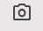

# A2UI Composer

Try building A2UI widgets interactively with the **A2UI Composer**.

1. Navigate to the [A2UI Composer](https://a2ui-project.github.io/composer/)

2. By default, you'll be using the Basic catalog provided by an Angular-based
   renderer

3. Use the Gemini chat to start building an A2UI interface! (**Note**: This
   requires a Gemini API key. See [below](#gemini-api-key))

## Using the Composer UI

The Composer workspace is split into several interactive panels to assist in
developing and debugging A2UI surfaces:

- **Gemini Assistant:** A chat interface powered by Gemini. You can use
  natural language prompts to ask Gemini to generate new layouts, refine the
  existing JSON, or modify visual attributes.
- You can **upload an attachment** (a mock, for example) by clicking the
  paper clip icon
  {style="width:30px;height:30px;display:inline;vertical-align:middle;"}.
- You can **include a screenshot** of the
  current A2UI interface by clicking the camera icon
  {style="width:30px;height:30px;display:inline;vertical-align:middle;"}.

- **Rendered A2UI Preview:** Displays the live visual preview of the active
  component.

- **A2UI JSON Editor:** Displays the raw JSON payload defining the UI
  structure and component hierarchy. You can edit this directly to instantly
  update the rendered preview.
- The editor has **[tooltips on hover](../assets/composer_editor_tooltip.png)**,
  showing the description of the A2UI element.
- If you have A2UI JSON from another source, you can paste it into this
  panel. You can right-click to format the JSON if you want.

- **Debug & Inspection Tabs (Bottom):**
    - **Data Model:** Inspects and modifies the runtime state/data values
      bound to the UI components. Changes here propagate to the preview, and
      user inputs in the preview update this model.
    - **Events:** Logs user-interaction events (e.g., clicks, inputs, or
      selections) dispatched by the rendered components.
    - **Errors:** Displays errors from rendering, JSON parsing, or API
      failures.
    - **Raw Messages:** Shows the communication between the Composer and the
      renderer, as well as interactions with Gemini. (See more [below](#raw-messages).)

## Components Gallery

The Components gallery allows you to browse through all the components which
are provided in the current A2UI catalog. Each component has an example
rendered, along with the A2UI JSON to produce that rendering. Use the copy icon
{style="width:30px;height:30px;display:inline;vertical-align:middle;"}
at the top of the Usage panel to copy the full A2UI JSON for this component.

At the bottom of the page is a table listing all the properties of the
component with descriptions, type, and indicating whether the property is
required or not.

## Settings

### Renderer Application

The settings page allows you to change the renderer application being used.
At this time, there are three preloaded renderer applications:

- Angular Basic Catalog
- Lit Basic Catalog
- React Basic Catalog

If you are building another renderer app, you can select "Custom" from the
dropdown, and put the URL in the text box. (For instructions on building a
renderer app, see [A2UI Composer Integration](./composer_renderer_integration.md)).

### Gemini API Key

This is also where you can enter a Gemini API key, enabling use of the Gemini
chat feature.

To obtain an API key:

1. Go to [Google AI Studio](https://aistudio.google.com/api-keys) and sign in
   with your Google account.
2. Click Create API key.
3. Select or create a Google Cloud project when prompted, then click Create key.
4. Save your key in a secure location!

Note that the A2UI Composer encrypts your key and stores it locally in your
browser's secure database using the [Web Crypto API](https://developer.mozilla.org/en-US/docs/Web/API/Web_Crypto_API).
Neither Google nor anyone else has access to this key.

## Work in Progress

The A2UI team is actively working on the following improvements:

- **Latency reduction:** Improving latency within Gemini-assisted workflows.
- **Visual understanding:** Updating Gemini-assisted workflows to improve
  visual understanding of already rendered surfaces.

## Raw Messages

The messages which flow between the Composer and the renderer can help with
troubleshooting and to gain a better understanding of what's going on. These
messages include:

- **RENDERER_READY**: Sent by the renderer once it has fully bootstrapped.
- **A2UI_CATALOG**: Sent by the renderer (upon request from the Composer).
  Contains the full A2UI catalog supported by the renderer.
- **COMPONENT_USAGES**: Sent by the renderer (upon request from the Composer),
  containing the data to support the Component Gallery page.

Whenever there is a change to the A2UI component's data model, the
**DATA_MODEL_CHANGE** message is captured, showing the `updateDataModel`
message which would be sent back to the agent.

Additionally, when using the Gemini chat feature:

- **LLM_REQUEST**: Shows the full request (including the system prompt) sent
  to the LLM.
- **LLM_RESPONSE**: Shows the full response received from the LLM.
