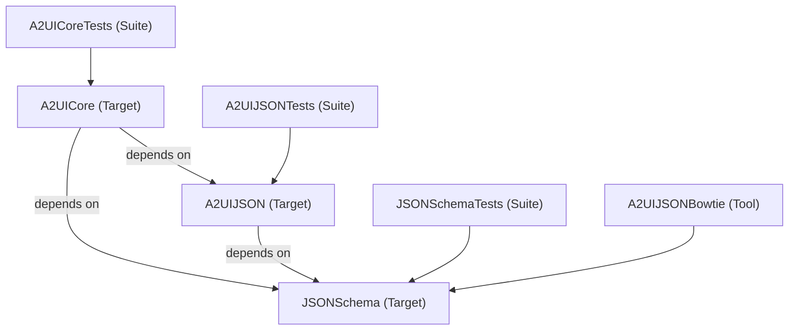
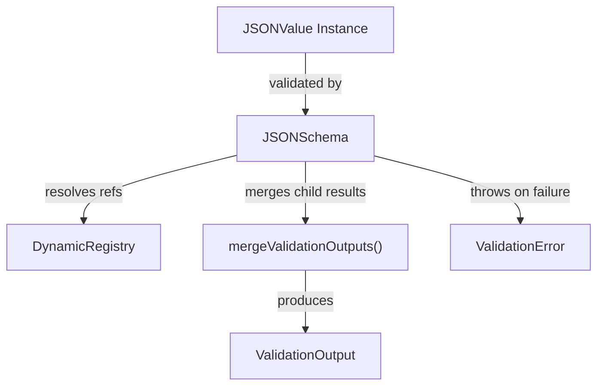
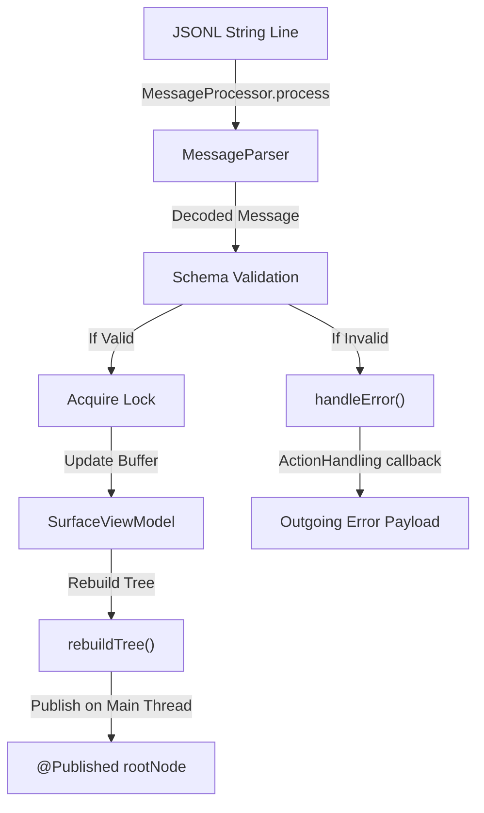

# Architectural Deep Dive & Design Patterns

This document provides a comprehensive overview of the design patterns, data flows, and internal
mechanics of the A2UI Swift Core engine. It is designed to help contributors understand the inner
workings of the generic JSON Schema validator and builder.

---

## 1. Modular Target Layout & Platforms

The library is split into three distinct targets. The target dependency graph is simple
and strictly unidirectional:



### Supported Platforms
The package supports multi-platform targets:
- **iOS 16.0+** (`.iOS(.v16)`)
- **macOS 13.0+** (`.macOS(.v13)`)

### Target Descriptions
* **`JSONSchema`**: A completely generic Draft 2020-12 validator with no dependencies on A2UI.
* **`A2UIJSON`**: A thin layer extending generic schema structures with A2UI-specific schemas.
* **`A2UICore`** is the stateful engine of the Swift Core renderer. It houses the core state machine,
  lifecycle management, validation routing, and event loop:
  - **`MessageProcessor`**: The thread-safe entry point coordinating JSONL decoding, schema
    validation, and routing. It manages the lifecycle of the active `SurfaceViewModel`.
  - **`SurfaceViewModel`**: The stateful view model managing the component buffer, two-way data
    model, and active theme. It publishes the resolved UI tree to the main thread.
  - **Action & Error Routing**: Facilitated by the `ActionHandling` callback protocol, converting
    internal validation and parsing errors into structured, outgoing `ClientServerError` payloads.


---

## 2. Lexical Scoping & Reference Resolution

JSON Schema Draft 2020-12 introduces complex reference resolution mechanics, including dynamic
anchors (`$dynamicAnchor`, `$dynamicRef`) and inline lexical scopes (`$id`).

### Lexical Scope Resolution
When a schema is parsed, the engine performs a pre-pass traversal via `resolveLexicalScopes()`.
During this pass:
1. Every subschema inherits its parent's base URI unless it defines its own `$id`.
2. If a subschema defines an `$id`, a new **lexical scope** is created, and all its children
   resolve their relative references against this new base URI.
3. Every schema anchor (`$anchor` and `$dynamicAnchor`) is registered in a flat map keyed by its
   absolute URI.

### Dynamic Registry
To support cross-document references and dynamic schema loading during validation (crucial for
test conformance runners like Bowtie), the engine employs a thread-safe **`DynamicRegistry`**:

```swift
public final class DynamicRegistry: @unchecked Sendable {
  private let lock = NSLock()
  private var storage: [URL: JSONSchema] = [:]
  
  public subscript(url: URL) -> JSONSchema? {
    get {
      lock.lock()
      defer { lock.unlock() }
      return storage[url]
    }
    set { ... }
  }
}
```

This registry uses an `NSLock` to prevent data races during concurrent validation passes while
avoiding expensive dictionary copying.

---

## 3. Declarative Swift DSL (Result Builders)

Our Swift DSL utilizes Swift's **Result Builders** to let developers write declarative, readable
JSON schemas in native Swift.

### Result Builders
We define `@resultBuilder` structs to collect DSL expressions into structured arrays:
* **`JSONSchemaPropertyBuilder`**: Collects `JSONSchemaProperty` definitions inside
  `JSONSchema.object`.
* **`JSONSchemaArrayBuilder`**: Collects list of schemas inside combinators like `anyOf`,
  `allOf`, and `oneOf`.

```swift
@resultBuilder
public struct JSONSchemaPropertyBuilder: Sendable {
  public static func buildExpression(_ expression: JSONSchemaProperty) -> JSONSchemaProperty {
    expression
  }
  public static func buildBlock(_ components: JSONSchemaProperty...) -> [JSONSchemaProperty] {
    Array(components)
  }
}
```

This builder compiles a clean block of properties into a structured dictionary behind the scenes,
making the Swift code read almost identically to raw JSON Schema.

---

## 4. Cycle Resolution in Reference Bundling

When serializing a complex schema using `print(bundleExternalRefs: true)`, the engine must resolve
recursive reference chains without getting stuck in infinite loops.

To accomplish this, `Serialization.swift` employs a cycle-detection tracker:
1. Before traversing a schema reference, its URI is added to a `visiting` set.
2. If the engine encounters a URI already in `visiting`, a **cycle is detected**.
3. Instead of recursing infinitely, the engine immediately registers an **empty stub schema**
   (`JSONSchema(ref: nil, id: uri)`) to break the recursion.
4. When the parent call unwinds, the stub is fully populated with its actual schema properties,
   ensuring a complete and correct `$defs` representation is output.

---

## 5. Validation Data Flow

Validation is structured as a tree-traversal that collects annotations and validation states.
The flow of validation outputs is depicted below:



* **`ValidationOutput`**: An immutable struct that collects evaluated properties, evaluated array
  items, and matched schema IDs.
* **`mergeValidationOutputs`**: Merges outputs from child properties, array items, and combinators
  (like `allOf`) while maintaining a unique set of matched schema IDs, preventing duplicate
  annotations.

---

## 6. Stateful Engine & Lifecycle Management (`A2UICore`)

The stateful runtime layer of A2UI Swift Core manages the lifecycle
of the UI surface, reactive state updates, and bidirectional event communication.

### Message Pipeline & Thread Safety
The core engine uses a thread-safe pipeline to process incoming JSONL messages and
publish updates:



### Lifecycle & Component Buffer
1. **Creation**: When a `createSurface` message is received, a new `SurfaceViewModel` is
   instantiated, optionally applying the catalog's decoded active theme.
2. **Buffering**: Incoming `updateComponents` messages are validated against the
   `ComponentCatalog` schemas *before* acquiring the write lock. Once validated, the component
   dictionary is merged into the thread-safe `componentBuffer` protected by an
   `NSRecursiveLock`.
3. **Data Binding**: The `updateDataModel` message updates the two-way data model at a
   specific path. Property resolution reads from this model to bind values dynamically.
4. **Teardown**: A `deleteSurface` message deallocates the active `SurfaceViewModel`.

### Action & Error Routing
Any parsing, decoding, or schema validation failures are caught, structured, and routed back
to the host application via the `ActionHandling` callback:
- **Validation Errors**: Internal `ValidationError` throws are mapped to `.validationFailed`
  containing the offending path and error message.
- **Decoding Errors**: Swift `DecodingError`s (like `.keyNotFound`, `.typeMismatch`,
  `.valueNotFound`) are mapped to `.validationFailed` with a resolved JSON Pointer. Data
  corruption errors are mapped to `.generic` with a `PARSING_FAILED` code.
- **Actions**: Interactive components trigger actions that are resolved, validated, and
  routed to the server as `ResolvedAction` payloads.
