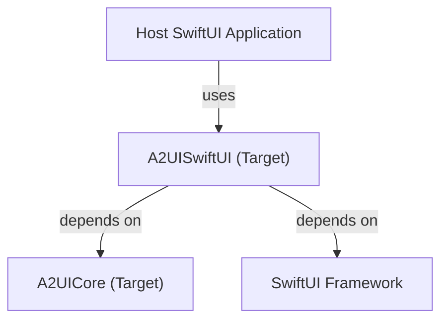

<!--
 Copyright 2026 Google LLC

 Licensed under the Apache License, Version 2.0 (the "License");
 you may not use this file except in compliance with the License.
 You may obtain a copy of the License at

     https://www.apache.org/licenses/LICENSE-2.0

 Unless required by applicable law or agreed to in writing, software
 distributed under the License is distributed on an "AS IS" BASIS,
 WITHOUT WARRANTIES OR CONDITIONS OF ANY KIND, either express or implied.
 See the License for the specific language governing permissions and
 limitations under the License.
-->

# A2UI SwiftUI Renderer Architecture

This document provides an in-depth architectural overview of the A2UI SwiftUI renderer package. It
describes the custom views, environment propagation, and reactive data binding mechanics.

---

## 1. Architectural Overview & Dependency Graph

`A2UISwiftUI` serves as the declarative UI rendering layer for the A2UI protocol. It depends
directly on `A2UICore` (the stateful engine) and the SwiftUI framework:



The rendering layer is designed to be lightweight, stateless, and fully reactive, translating the
state changes published by `SurfaceViewModel` into native SwiftUI view updates.

---

## 2. Core Rendering Components

The package defines two primary components that work together to render the UI tree:

### Surface

`Surface` is the entry point view for rendering an A2UI interface:

```swift
public struct Surface<Catalog: CatalogView>: View {
  @ObservedObject public var viewModel: SurfaceViewModel
  private let catalogType: Catalog.Type
  public let surfaceID: String
  ...
}
```

* **Observation**: It observes a `SurfaceViewModel` using `@ObservedObject` to reactively rebuild
  the view when the component tree or state changes.
* **State Resolution**: If `viewModel.rootNode` is `nil`, it renders a standard `ProgressView`.
  Once the root node is resolved, it renders the generic catalog view directly: `Catalog(node: rootNode)`.
* **Thematic Styling**: It injects the active `SurfaceTheme` into the SwiftUI environment, making it
  available to all children in the tree.

### CatalogView

`CatalogView` is a SwiftUI `View` protocol that maps abstract `Node` instances into concrete SwiftUI views:

```swift
public protocol CatalogView: View {
  init(node: Node)
}
```

* **Zero Type Erasure**: Because `CatalogView` is itself a native SwiftUI `View`, it completely avoids `AnyView` type erasure. This preserves SwiftUI's view identities, enabling high-performance animations and layout transitions.
* **Recursive Rendering**: Layout containers (like stacks or lists) can render their child nodes recursively by simply instantiating the catalog view:
  ```swift
  VStack {
    ForEach(children) { child in
      MyCatalogView(node: child)
    }
  }
  ```

---

## 3. Dependency Injection via the SwiftUI Environment

We leverage SwiftUI's native environment system to propagate dependencies down the view tree:

### Theme Propagation (`A2UIThemeKey`)

The active theme is retrieved from the view model (`viewModel.getActiveTheme()`) and injected into
the environment under `a2uiTheme`. Custom views can retrieve this theme and apply its colors and
styles:

```swift
struct MyCustomButton: View {
  let node: Node
  @Environment(\.a2uiTheme) private var theme

  var body: some View {
    let mockTheme = theme as? MockTheme
    Button("Tap") { ... }
      .background(mockTheme?.primaryColor ?? .blue)
  }
}
```

---

## 4. Two-Way Data Binding (`DataBinding+SwiftUI`)

A2UI features a robust, bidirectional state synchronization model. The `DataBinding` type from
`A2UICore` manages the get/set logic against the stateful data model.

We extend `DataBinding` to expose a native SwiftUI `Binding` property:

```swift
extension DataBinding {
  public var swiftUI: Binding<Value> {
    Binding(
      get: { self.get() },
      set: { newValue in self.set(newValue) }
    )
  }
}
```

### Flow of a Reactive Update

1. **User Interaction**: The user types into an input field bound to a property.
2. **SwiftUI Update**: SwiftUI invokes the `set` block of the `Binding`, which delegates to
   `DataBinding.set(newValue)`.
3. **Core Mutation**: The core engine mutates the underlying data model at the specified path.
4. **Reactive Rebuild**: `SurfaceViewModel` publishes the change, triggering SwiftUI to
   re-evaluate the view hierarchy and update any bound components (e.g., a text label
   displaying the value).

---

## 5. Thread Safety & Reentrancy

* **Main Thread Publishing**: All updates to the `@Published rootNode` in `SurfaceViewModel` are
  dispatched on the `@MainActor`, ensuring SwiftUI views are always modified on the main thread.
* **Concurrent Writes**: The underlying data model mutations are protected by recursive locks in
  `A2UICore`.
* **Reentrancy Protection**: If a binding set operation triggers subsequent synchronous updates,
  the core's lock prevents race conditions and data corruption.
