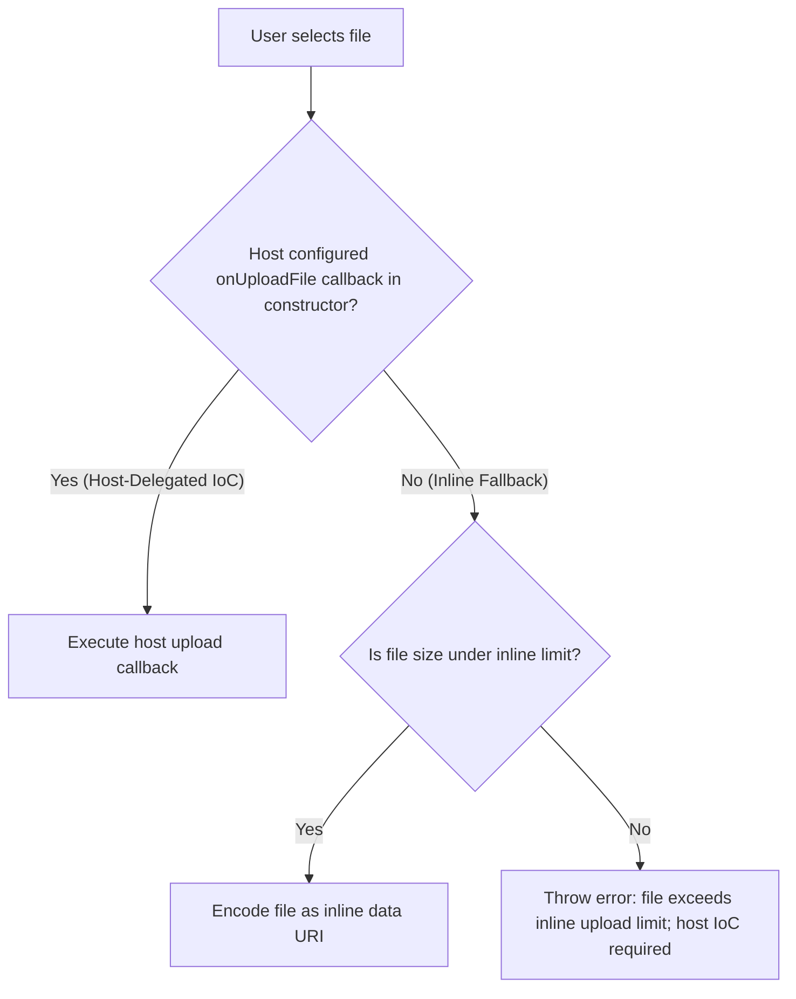

# A2UI FileUpload UI Component - Architecture Design Proposal

Upload delegation and file handling without context bloat

## 1. Executive summary

As agents expand to handle multimodal tasks, the Agent-to-UI (A2UI) protocol must support file
uploads such as documents and images natively. In standard A2UI workflows, the user action event
relay embeds client data directly into the JSON action payload. If we leverage this native relay for
files without restrictions, raw binary data would be embedded directly into the payload. Because
these payloads are often appended to the agent's conversation history, this approach can cause
context bloat and performance degradation for large files.

This proposal recommends a simplified, dual-strategy architecture combining inversion of control
(IoC) with an inline upload fallback. A single, polymorphic FileUpload component delegates upload
execution to the host application via an IoC callback (`onUploadFile`) configured programmatically
when registering the component in the catalog. For lightweight web environments or rapid prototyping
where no host callback is configured, the component falls back to an inline upload strategy,
encoding small files directly as data URIs. Direct client-led HTTP upload with presigned URLs is
reserved as a future extension to keep the core component free of networking transport complexity.
During model inference, file pointers are resolved out of band via implicit resolution when agent
and host share a storage schema, or via explicit resolution when operating across trust boundaries
without a shared schema.

## 2. Problem statement

- Context congestion: Encoding large binary files directly into LLM prompts or A2UI JSON-RPC
  payloads increases latency, token consumption, and memory usage.
- Multi-surface requirement: Session states between users and A2UI agents must transition across
  desktop, web, mobile, and wearable devices without losing access to file attachments. This
  requirement disqualifies local-only file storage techniques.
- Framework interoperability: Both agent development SDKs (such as LangChain, LlamaIndex, and ADK)
  and foundation model APIs (such as Claude and Gemini) need to parse file references out of the box
  without requiring custom middleware to decode proprietary protocols.

## 3. Industry precedents (MCP, ChatGPT, Claude)

- Abstract pointer pattern: Commercial platforms separate the upload pipeline from the messaging
  pipeline. When a user uploads a file, it goes directly to cloud blob storage. The chat state
  records only an abstract identifier such as `file-12345` or a presigned URL.
- Just-in-time (JIT) resolution: Backend orchestration layers resolve these identifiers into raw
  binaries or extracted text at the moment of model inference, keeping transport layers lightweight.
- Model Context Protocol (MCP): MCP handles file references out of band by passing standard URIs and
  file paths to servers, avoiding payload bloat.

## 4. Proposed solution: the unified hybrid architecture

Rather than building complex HTTP uploaders into the web component or forcing host developers to use
a single network protocol, A2UI handles file uploads using a dual-strategy model orchestrated by an
environment-aware web component.

### The single component, dual strategy model

Agent developers declare a `<FileUpload>` component without needing to know whether the user is on a
web browser, a native iOS app, or an enterprise sandbox. The component internally determines how to
transport the file:

- Host-delegated mode (IoC primary strategy): In production web, enterprise, or native mobile apps,
  the host application passes an upload callback programmatically to the component constructor or
  factory when registering it in the catalog. The component intercepts the file and hands the binary
  object directly to the host callback in memory. The host performs the upload via its own secure
  channels and returns an abstract reference ID (`fileId: "host-file-ref-789"`).
- Inline upload mode (fallback strategy): If no host callback is configured, the component falls
  back to encoding small files as inline data URIs (`fileId: "data:image/png;base64,..."`). This
  enables rapid prototyping and lightweight web usage out of the box without requiring cloud bucket
  provisioning.
- Future extension (presigned URLs): Direct client-led HTTP uploading with presigned URLs is left as
  a future extension.

In all scenarios, the final payload sent to the agent backend remains a uniform reference string
(`fileId`), keeping the WebSocket and JSON-RPC layers clean.



### Pointer resolution: implicit versus explicit approaches

Once a file is uploaded and an abstract reference ID (`fileId`) is produced, the agent must resolve
that pointer into physical bytes or extracted text during model inference. The architecture supports
two resolution models depending on the trust boundary and coupling between the agent and the host:

- Implicit resolution (shared schema): When the agent and host operate within the same
  organizational boundary or share an agreed-upon URI schema (such as `gdrive://<id>`,
  `s3://<bucket>/<key>`, or `enterprise-vault://<id>`), resolution is implicit. The host passes the
  abstract URI string in the action payload, and the agent's backend adapter recognizes the URI
  prefix to fetch the physical file out of band using its own pre-configured backend credentials or
  SDKs.
- Explicit resolution (unshared schema): When the agent and host operate across organizational
  boundaries without a pre-shared storage schema (such as third-party agents or multi-vendor
  ecosystems), resolution is explicit. Because the agent cannot assume how to interpret a
  proprietary pointer or authenticate against a private bucket, the host provides explicit
  resolution instructions. This is achieved either by sending an ephemeral, authenticated HTTPS
  download URL (`https://host.domain.com/api/files/download/<token>`), by passing self-describing
  resolver metadata in the event payload, or by exposing a standardized read-resource tool (as seen
  in the Model Context Protocol) that the agent calls to retrieve file contents.

## 5. Division of responsibilities

| Feature / Layer                       | Responsible Party                 | Description & Mechanism                                                                                                                                                                                                                                  |
| :------------------------------------ | :-------------------------------- | :------------------------------------------------------------------------------------------------------------------------------------------------------------------------------------------------------------------------------------------------------- |
| **UX & UI state management**          | A2UI core library                 | Implements drag-and-drop zones, file queues, progress indicators, pause/resume controls, and error states natively inside the web component.                                                                                                             |
| **Host-delegated transport (IoC)**    | Host developer (primary strategy) | Passes an upload callback (`onUploadFile`) programmatically when registering the component in the catalog to route uploads through native OS daemons or internal VPC endpoints.                                                                          |
| **Inline upload transport**           | A2UI core library (fallback)      | Automatically encodes small files as inline base64 data URIs when no host callback is present, enabling out-of-the-box rapid prototyping.                                                                                                                |
| **Storage infrastructure & security** | Host developer                    | Provisions cloud storage buckets (S3 or GCS), configures CORS and CSP headers, enforces malware scanning, and sets lifecycle rules for orphaned files.                                                                                                   |
| **Pointer resolution & inference**    | Agent backend developer           | Resolves the `fileId` payload into raw bytes just in time—using implicit schema agreements (such as `gdrive://` or `s3://`) for internal agents, or explicit resolution mechanisms (such as ephemeral HTTPS URLs or resource tools) for external agents. |

## 6. Technical implementation

We package `FileUpload` as an optional extension module (`@a2ui/plugin-fileupload`). By removing
internal HTTP chunking and networking engines, the component remains lightweight and focused on UI
state and strategy delegation.

#### A. Component catalog schema definition (the agent's interface)

To integrate `FileUpload` into the A2UI ecosystem, it is defined in the catalog schema. This
contract outlines the properties the agent can configure and the events it will receive. Note that
presigned URL properties are omitted from this schema and reserved for future extensions.

```ts
import {ComponentDefinition} from '@a2ui/core';

export const FileUploadDefinition: ComponentDefinition = {
  type: 'FileUpload',

  // 1. Properties: Configured by the agent during rendering
  properties: {
    accept: {
      type: 'string',
      optional: true,
      description: 'Allowed MIME types (e.g., "image/jpeg, application/pdf")',
    },
    maxSize: {
      type: 'number',
      optional: true,
      description: 'Maximum file size in bytes',
    },
    multiple: {type: 'boolean', optional: true, default: false},
    label: {
      type: 'string',
      optional: true,
      default: 'Drag and drop files or click to upload',
    },
  },

  // 2. Events: Dispatched from the component back to the agent via JSON-RPC
  events: {
    upload_complete: {
      description: 'Fired once a file (or batch of files) is successfully uploaded.',
      payloadSchema: {
        surfaceId: {
          type: 'string',
          description: 'The ID of the surface where the file upload occurred.',
        },
        files: {
          type: 'array',
          description: 'Array of resolved abstract file pointers or inline data URIs.',
          items: {
            type: 'object',
            properties: {
              fileId: {type: 'string'},
              metadata: {
                type: 'object',
                properties: {
                  fileName: {type: 'string'},
                  fileSize: {type: 'number'},
                  mimeType: {type: 'string'},
                },
              },
            },
          },
        },
      },
    },
  },
};
```

#### B. The polymorphic component logic

The web component handles visual states such as drag-and-drop zones and progress bars, while
inspecting its constructor configuration to execute either host delegation or inline data URI
encoding:

```ts
export interface FileUploadConfig {
  /** Primary strategy: Host-delegated upload callback for production web, mobile, or enterprise VPCs */
  onUploadFile?: (file: File, onProgress: (percent: number) => void) => Promise<string>;
  /** Callback fired when a file is removed from the UI queue */
  onRemoveFile?: (pointerUri: string) => void;
  /** Maximum file size allowed for fallback inline data URI encoding (in bytes, default 500KB) */
  maxInlineSize?: number;
}

export class FileUploadComponent extends HTMLElement {
  private config: FileUploadConfig;

  constructor(config: FileUploadConfig = {}) {
    super();
    this.config = {
      maxInlineSize: 500_000, // 500KB default limit for inline fallback
      ...config,
    };
  }

  async handleFileSelect(file: File) {
    this.updateUIState('uploading', 0);

    try {
      let fileId: string;

      // Strategy 1: Host-delegated IoC via programmatic constructor configuration
      if (this.config.onUploadFile) {
        fileId = await this.config.onUploadFile(file, percent => this.updateProgress(percent));
      }
      // Strategy 2: Fallback inline upload for small files
      else if (file.size <= (this.config.maxInlineSize || 500_000)) {
        fileId = await this.encodeAsDataUri(file);
      } else {
        throw new Error(
          `File size (${file.size} bytes) exceeds inline upload limit. ` +
            'A host onUploadFile callback must be configured for large file uploads.',
        );
      }

      // Final dispatch to agent contains only the resolved fileId pointer
      this.dispatchUserAction('upload_complete', {fileId});
      this.updateUIState('success');
    } catch (err) {
      this.updateUIState('error', (err as Error).message);
    }
  }

  private updateUIState(state: string, detail?: number | string) {
    // DOM rendering logic for progress bars and badges
  }

  private updateProgress(percent: number) {
    this.updateUIState('uploading', percent);
  }

  private encodeAsDataUri(file: File): Promise<string> {
    return new Promise((resolve, reject) => {
      const reader = new FileReader();
      reader.onload = () => resolve(reader.result as string);
      reader.onerror = () => reject(new Error('Failed to encode file as data URI'));
      reader.readAsDataURL(file);
    });
  }
}
```

#### C. Batching and error handling

If `multiple` is true and a user drops multiple files, the component processes them concurrently. To
avoid LLM race conditions, the component batches successful uploads into a single `upload_complete`
event. If individual files fail, successful files are dispatched immediately while failed files
remain in the UI queue with a retry option.

```ts
export class FileUploadComponent extends HTMLElement {
  // ... (methods from above) ...

  async handleMultipleFiles(files: File[]) {
    const successfulFiles: Array<{fileId: string; metadata: FileMetadata}> = [];

    await Promise.all(
      files.map(async file => {
        this.updateUIStateForFile(file.name, 'uploading', 0);
        try {
          const fileId = await this.executeUploadStrategy(file);
          const metadata = this.getFileMetadata(file);
          successfulFiles.push({fileId, metadata});
          this.updateUIStateForFile(file.name, 'success');
        } catch (err) {
          this.updateUIStateForFile(file.name, 'error_retry', (err as Error).message);
        }
      }),
    );

    if (successfulFiles.length > 0) {
      this.dispatchUserAction('upload_complete', {files: successfulFiles});
    }
  }
}
```

#### D. Host application component registration (programmatic configuration)

For the component to function in production or enterprise environments, the host developer passes an
upload callback programmatically to the component factory when registering `FileUpload` into the
catalog. For rapid prototyping, registering the component without a callback automatically enables
inline upload.

```ts
import {Catalog} from '@a2ui/web_core/v0_9';
import {createFileUploadComponent} from '@a2ui/plugin-fileupload';

const catalog = new Catalog();

// 1. Production host (enterprise web, desktop, or native mobile IoC)
// The host passes a direct upload callback when registering the component:
catalog.addComponent(
  'FileUpload',
  createFileUploadComponent({
    onUploadFile: async (file: File, onProgress: (percent: number) => void): Promise<string> => {
      // Bridges directly to host network layer or native OS daemons
      const response = await hostUploadService.upload(file, onProgress);
      return response.fileId; // Returns abstract pointer (e.g., s3://bucket/key)
    },
  }),
);

// 2. Rapid prototyping or lightweight demo host (inline upload fallback)
// Registering without onUploadFile uses inline data URIs for files up to 1MB:
catalog.addComponent(
  'FileUpload',
  createFileUploadComponent({
    maxInlineSize: 1_000_000,
  }),
);
```

#### E. Agent backend resolution (the FileResolver adapter)

The backend SDK relies on a storage adapter pattern (`FileResolver`). During model inference, this
resolver inspects the incoming `fileId` and applies either an implicit or explicit resolution
strategy:

- Implicit resolution (shared schema): For internal agents sharing a known schema (such as `s3://`
  or `gdrive://`), the adapter matches the URI prefix and uses backend service credentials to
  download the object out of band.
- Explicit resolution (unshared schema): For external agents or unshared schemas, the adapter either
  performs a standard HTTP GET against an ephemeral HTTPS download URL or calls an
  environment-provided resource read tool.

```python
import base64
import boto3
import httpx
from a2ui_sdk.server import A2UIOrchestrator, SessionData
from adk.core import Agent, LLMProvider

s3_client = boto3.client('s3', region_name='us-east-1')

# 1. Define resolution adapter (handling inline URIs, implicit schemas, and explicit HTTPS URLs)
async def resolve_file_adapter(file_id: str, session: SessionData) -> bytes:
    # Strategy 1: Inline data URI fallback
    if file_id.startswith("data:"):
        header, base64_data = file_id.split(",", 1)
        return base64.b64decode(base64_data)

    # Strategy 2: Implicit resolution via shared schema (e.g., s3:// or gdrive://)
    if file_id.startswith("s3://"):
        bucket, key = file_id.replace("s3://", "").split("/", 1)
        response = s3_client.get_object(Bucket=bucket, Key=key)
        return response['Body'].read()

    # Strategy 3: Explicit resolution via unshared schema (e.g., ephemeral HTTPS download URL)
    if file_id.startswith("https://"):
        async with httpx.AsyncClient() as client:
            response = await client.get(file_id, follow_redirects=True)
            response.raise_for_status()
            return response.content

    raise ValueError(f"Unsupported file pointer schema: {file_id}")

# 2. Initialize the A2UI Backend SDK with the resolution adapter
orchestrator = A2UIOrchestrator(file_resolver=resolve_file_adapter)
agent = Agent(llm_provider=LLMProvider.GEMINI)

# 3. Just-in-time (JIT) resolution during model inference
@orchestrator.on_user_action("upload_complete")
async def handle_upload_complete(payload: dict, session: SessionData):
    file_id = payload.get("fileId")

    # 4. The SDK executes the registered adapter to retrieve physical bytes
    file_bytes = await orchestrator.resolve_file(file_id, session)

    # 5. Pass bytes directly into the multimodal context window
    response = await agent.generate_content(
        prompt="Please analyze this uploaded document.",
        attachments=[{
            "data": file_bytes,
            "mime_type": "application/pdf"
        }]
    )
    return response
```

## 7. Security and operational benefits

- Reduced complexity in core components: By deferring presigned URL support to a future extension,
  the `<FileUpload>` web component requires no internal HTTP client, chunked uploading logic, or
  CORS troubleshooting.
- Declarative purity and graceful degradation: Agent developers write one generic `<FileUpload>`
  tag. The system adapts to the capabilities of the host environment without leaking implementation
  logic to the agent.
- Native mobile resiliency: By supporting host delegation, iOS and Android implementations bypass
  WebView thread suspension limits, handing large uploads off to native background daemons.
- Flexible pointer resolution across trust boundaries: Supporting both implicit resolution (via
  shared URI schemas) and explicit resolution (via ephemeral HTTPS URLs or resource tools) allows
  organizations to deploy agents internally with zero-overhead schema contracts, while supporting
  third-party agents without exposing internal cloud storage topology.
- Zero prompt and schema pollution: Configuring the upload callback programmatically on the
  component constructor prevents upload handlers from appearing in the catalog JSON schema. This
  eliminates the risk of an LLM hallucinating calls to upload functions from arbitrary components.
- Immediate prototyping capability: Developers building demos can use inline upload immediately
  without provisioning cloud storage buckets or backend upload endpoints.
- Orchestrator data sovereignty: Standardizing on abstract identifiers ensures orchestrators can
  enforce multi-agent isolation. Utilities such as `A2uiSubagentMap` can strip unowned file pointers
  from sub-agent payloads to prevent cross-agent data leakage.
- Zero-trust file validation: Schema properties such as `accept` and `maxSize` are client-side UI
  conveniences. Because physical file transport bypasses the JSON-RPC layer, host bucket policies
  and backend `FileResolver` adapters must enforce file size limits, verify MIME types, and execute
  malware scanning before passing bytes into the LLM context window.

## 8. Rollout strategy and tactical recommendations

To advance development, deploy to GE, and engage the Security Review team promptly, we recommend the
following phased rollout:

- Commit immediately to the dual architecture of **inversion of control (IoC)** and **inline
  upload**. This covers production enterprise web and native mobile environments via host delegation
  while enabling rapid prototyping via inline data URIs.
- Reserve client-led presigned URL transport (`uploadUrl`) as a future plugin extension. This keeps
  the initial codebase lean and focused on core UI state management and host integration.
