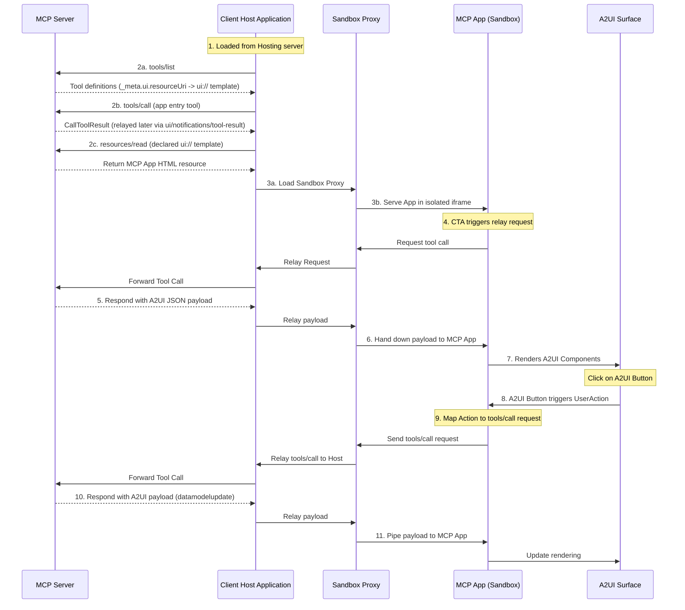

# A2UI in MCP Apps Sample

This sample demonstrates a Model Context Protocol (MCP) Application Host that isolation-tests untrusted third-party Angular components via a secure double-iframe proxy pattern.

## Architecture

- **`client/`**: The host container application (Angular). It hosts the outer safe iframe.
- **`server/`**: The MCP Server (Python/uv) that provides the micro-app resources and tools.
- **`server/apps/src/`**: Source code for the **Basic** isolated micro-app.
- **`server/apps/editor/`**: Source code for the **Editor** isolated micro-app.

## Communication Flow



---

## Prerequisites

- [Node.js](https://nodejs.org/) (LTS recommended)
- [uv](https://docs.astral.sh/uv/) (Python is managed automatically by uv using the version pinned in server/.python-version)

### ⚠️ IMPORTANT: Install Repository Dependencies

Run the following from the repository root to link workspace packages:

```bash
yarn install
```

---

## Build & Regeneration

This sample relies on generated bundle artifacts.

### 1. Build Client Sandbox Bridge

The sandboxed iframe needs its asset bundle. Run this in the `client/` directory:

```bash
cd client
yarn install
yarn build:sandbox
```

_(Generates `client/public/sandbox_iframe/sandbox.{js,html}`)_

### 2. Build the Micro-Apps

The server serves single-file HTML artifacts from `server/apps/public/`. These artifacts are git-ignored and are **not** included in a fresh checkout, so you must build at least one app before its surface can load (the server itself still starts without them). Choose the app(s) you want to build:

#### Option A: The Editor App

```bash
cd server/apps/editor
yarn install
yarn build:all
```

_(Generates `server/apps/public/editor.html`)_

#### Option B: The Basic App

```bash
cd server/apps/src
yarn install
yarn build:all
```

_(Generates `server/apps/public/app.html`)_

---

## Running the Sample

### 1. Start the MCP Server

Run this in the `server/` directory:

```bash
cd server
uv sync
uv run python server.py --transport sse --port 8000
```

### 2. Start the Host Client

Run this in the `client/` directory:

```bash
cd client
yarn start
```

Navigate to `http://localhost:4200` to view the running host.
