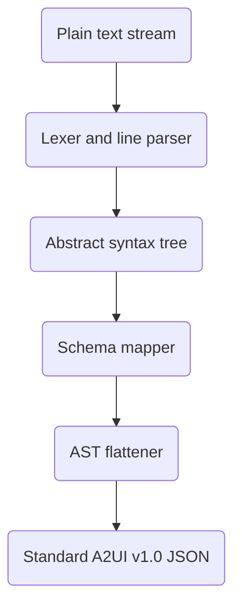

# A2UI Express technical specification

A2UI Express is a compact, model-optimized declarative syntax designed for dynamic generative user interfaces. It acts as an intermediate, highly compressed representation that on-device large language models generate to describe user interfaces. A host-side compiler parses this syntax and compiles it into standard A2UI v1.0 wire protocol payloads.

## Core design goals

The design of A2UI Express focuses on four main requirements:

- Token footprint reduction. Generative models spend excessive output tokens when producing verbose JSON structures. A2UI Express removes structural keys, brackets, and repeated quotes, reducing output tokens by 55% to 70% compared to native A2UI wire payloads.
- On-device model optimization. Small local models, such as Gemma 4 E2B and E4B, operate with limited context windows and reasoning budgets. The syntax uses clean positional signatures that fit into prompt contracts without consuming excessive context.
- Streaming compatibility. The line-oriented grammar allows the client host to parse and build the component hierarchy line-by-line, enabling progressive rendering of the interface before the model finishes its output.
- Protocol alignment. A2UI Express preserves full semantic compatibility with standard A2UI v1.0, supporting data bindings, client validation rules, and local event handling.

## Syntax and grammar

A2UI Express layout blocks must be enclosed inside the `<a2ui>` and `</a2ui>` sentinel tags to cleanly separate the user interface DSL from any accompanying conversational text:

```
<a2ui>
variable_name = ComponentName(argument1, argument2, ...)
</a2ui>
```

Every instruction in A2UI Express is a variable assignment statement. Statements are separated by newlines, and a single assignment can format-span multiple lines:

```
variable_name = ComponentName(argument1, argument2, ...)
```

The syntax rules define how types, structures, data paths, and validation actions are expressed.

### Variable declarations

Every component definition is assigned to a unique variable identifier. The compiler uses these variables to resolve parent-child hierarchies. A reserved variable named `root` acts as the primary entry point for the interface tree.

To support multi-lingual models while ensuring syntax safety for future extensions (such as math or conditional expressions), all variable identifiers MUST conform to the Unicode Identifier standard ([UAX #31](https://www.unicode.org/reports/tr31/)):

- An identifier must start with a Unicode letter or an underscore `_`.
- Subsequent characters must be Unicode letters, digits (`0-9`), or underscores `_`.

To eliminate syntax errors from complex bracket structures and enable line-oriented streaming compilation, A2UI Express prohibits inline component nesting. Component constructor calls (e.g., `Text(...)`, `Column(...)`) can **only** appear on the right-hand side of a variable assignment (`var = ComponentName(...)`). They **cannot** be passed directly as positional arguments to other components. Instead, you must declare them separately and reference their variable names.

### Core primitive types

The syntax supports three literal primitive types:

- **Strings** are represented in two formats:
  - **Standard Strings**: Enclosed in single double quotes (e.g., `"Enter your name"`) or triple double quotes (e.g., `"""Line 1\nLine 2"""`). Standard strings support common escape sequences: `\n` (newline), `\t` (tab), `\\` (backslash), and `\"` (double quote). Embedded newlines are allowed.
  - **Raw Strings**: Prefaced by `r` (e.g., `r"^[a-zA-Z]+$"` or `r"""Raw multi-line content"""`). In raw strings, no escape sequences are processed, and backslashes are interpreted as literal characters. This is particularly useful for validation regex patterns containing backslashes. Embedded newlines are allowed.
- **Numbers** are written as plain integers or decimals, for example `42` or `3.14` or `-1`.
- **Booleans** are represented by `true` or `false`.
- **Null values** are represented by `null`.

Omitted or skipped arguments are not represented by a literal type; instead, they are handled via syntax rules (see [Schema-driven key mapping](#schema-driven-key-mapping)).

### Structural lists

Arrays are represented using square brackets, for example `[component1, component2]`. The compiler maps these arrays to child container slots in the target catalog components.

If a component property expects a dynamic list template (such as the `children` slot of a `List` component), it uses the compiler-reserved `_template(path, templateComponent)` helper:

```
breedList = List(_template($/breeds, breedTemplate), "horizontal")
```

The helper starts with an underscore `_` to clearly distinguish it from components in custom catalogs and prevent naming conflicts.

### Data binding and reactive paths

To connect component properties to the application data model, properties accept bound paths prefixed with the `$` symbol:

- Absolute paths start with a forward slash after the prefix, for example `$/user/email`. These paths resolve from the root of the shared data model.
- Relative paths omit the slash, for example `$lastName`. These resolve within list iteration contexts.

### Data model population

To populate or initialize values within the shared data model directly from the generated output, A2UI Express supports data model assignments. A statement with a left-hand side that represents an absolute data path will populate that path in the surface's `dataModel`:

```
$/path/to/key = value_expression
```

Where `value_expression` is any valid literal primitive, array, or map. For example:

```
$/icon = "check"
$/title = "Enable notification"
$/user = {firstName: "Alice", age: 30}
```

The compiler resolves these statements and generates the structured `dataModel` JSON object at the root of the `createSurface` payload.

If an A2UI Express block contains only data path assignments and omits the reserved `root` component variable entirely, the compiler produces a standalone `updateDataModel` protocol message instead of a `createSurface` layout payload:

```json
{
  "version": "v1.0",
  "updateDataModel": {
    "surfaceId": "default_surface",
    "path": "/",
    "value": {
      "icon": "check",
      "title": "Enable notification"
    }
  }
}
```

### Nested function calls and actions

To support catalog flexibility and avoid hardcoding specific formatting or action helpers, A2UI Express uses standard nested function call syntax.

- Client functions are written as `<FunctionName>(<args>)`, matching the exact function names registered in the loaded catalog.
- If the client catalog contains a text formatting helper (such as `formatString`), it is called explicitly: `welcomeText = Text(formatString("Welcome, ${/user/firstName}!"))`. This prevents failures if a client catalog uses a different naming convention for interpolation.
- Local actions use this same signature to trigger behaviors, for example `openUrl("https://example.com")`. The compiler maps these to standard client function actions.
- Server events use a reserved `Event` signature to declare backend actions, for example `Event("save_deal", {rep: $/form/rep})`.

### Validation and logic expressions

Form validation checks are defined using the `?` prefix. If a component expects validation rules, the compiler converts these expressions into standard client-side functions:

- Simple checks are written with the function name, for example `?required`.
- Parameterized checks accept arguments in parentheses, for example `?regex("^[0-9]{5}$", "Must be a valid zip code")`.
- Multiple checks are grouped in lists: `[?required, ?email]`.

### Standalone operations and function calls

To execute standalone lifecycle operations or invoke client-side functions directly from the server, A2UI Express supports standalone function call lines without variable assignments:

#### Deleting a surface

When the compiler encounters the standalone `deleteSurface` command, it produces a standard `deleteSurface` lifecycle message:

```
deleteSurface("dashboard-surface-1")
```

```json
{
  "version": "v1.0",
  "deleteSurface": {
    "surfaceId": "dashboard-surface-1"
  }
}
```

#### Executing client-side functions (RPC)

When the compiler encounters any other standalone function call, it resolves the arguments against catalog definitions and produces a standard `callFunction` RPC message with an auto-generated `functionCallId`:

```
openUrl("https://example.com")
```

```json
{
  "version": "v1.0",
  "functionCallId": "call_1",
  "callFunction": {
    "call": "openUrl",
    "args": {
      "url": "https://example.com"
    }
  }
}
```

## Compilation pipeline

The compilation runs as part of the inference pipeline. It takes the plain text stream of A2UI Express, processes it, and emits a standard A2UI v1.0 JSON payload to send to the client.



### Line parsing and tokenization

The compiler reads the input text line-by-line. It discards empty lines and parses assignments into tokens.

### Error recovery and micro-refinement loops

If the compiler encounters a syntax error or catalog schema mismatch during parsing, it triggers a structured error recovery workflow:

1. Isolation. The compiler flags the invalid line, discards that sub-branch of the AST, and continues parsing the remaining lines to avoid collapsing the user interface.
2. Agent-side micro-refinement. The agent packages the invalid line, the targeted component signature, and the parser error message into a tiny correction prompt.
3. Fast model-based correction. This correction prompt is sent to a fast foundation model before converting the A2UI Express syntax to proper A2UI. Because the prompt is small and targets a single line, execution is fast.
4. Hot swapping. The model returns the corrected statement, which the compiler hot-swaps into the active AST before finalizing the render output.

### Schema-driven key mapping

Because A2UI Express omits property keys, the compiler relies entirely on the JSON schema of the loaded catalog to map positional arguments.

1. The compiler looks up the component or function name in the catalog schema, discarding structural keys like `component` and `id`.
2. It reads the declared properties in their strict definition order.
3. It maps the positional arguments of the A2UI Express statement to these property keys in sequence.
4. Trailing optional arguments can be omitted from the end of the statement. For example, if a component signature is `Button(child, action?)` where `action` is optional, `Button(label_text)` is compiled with `action` as null/omitted.
5. Skipped optional arguments (where a subsequent argument must be specified) are represented by an underscore `_` placeholder. For example, if `justify` is optional in `Column(children, justify?, align?)`, `Column([icon, title], _, "center")` maps the array to `children` and `"center"` to `align`, leaving `justify` unspecified.

### Adjacency list flattening

Standard A2UI v1.0 requires a flat array of components where nesting is represented by referencing IDs in an adjacency list.

1. The compiler traverses the variable references starting at the `root` variable.
2. It generates a unique, stable string ID for each sub-component variable, replacing variable names with these IDs.
3. It packages child arrays into standard `ChildList` structures.
4. It outputs a single flat `components` array.

### Protocol envelope construction

The compiled component list and any extracted default data models are wrapped in a standard A2UI message envelope:

```json
{
  "version": "v1.0",
  "createSurface": {
    "surfaceId": "surface_id",
    "catalogId": "catalog_identifier",
    "components": [],
    "dataModel": {},
    "surfaceParams": {}
  }
}
```

## Compilation example

This section shows an input text stream in A2UI Express and the compiled A2UI v1.0 JSON payload.

### Input text stream

The input file defines a notification permission card, using positional arguments and absolute data paths enclosed within the `<a2ui>` and `</a2ui>` sentinel tags:

```
<a2ui>
root = Card(main_column)
main_column = Column([icon, title, description, actions], _, "center")
icon = Icon($/icon)
title = Text($/title, "h3")
description = Text($/description, "body")
actions = Row([yes_btn, no_btn], "center")
yes_btn_text = Text("Yes")
yes_btn = Button(yes_btn_text, _, Event("accept"))
no_btn_text = Text("No")
no_btn = Button(no_btn_text, _, Event("decline"))
</a2ui>
```

### Compiled A2UI JSON output

The compiler parses the text stream, resolves the parent-child references, maps positional arguments to the catalog schema, and produces the following flat component layout inside the `createSurface` message:

```json
{
  "version": "v1.0",
  "createSurface": {
    "surfaceId": "gallery-notification-permission",
    "catalogId": "https://a2ui.org/specification/v1_0/catalogs/basic/catalog.json",
    "components": [
      {
        "id": "root",
        "component": "Card",
        "child": "main_column"
      },
      {
        "id": "main_column",
        "component": "Column",
        "children": ["icon", "title", "description", "actions"],
        "justify": null,
        "align": "center"
      },
      {
        "id": "icon",
        "component": "Icon",
        "name": {
          "path": "/icon"
        }
      },
      {
        "id": "title",
        "component": "Text",
        "text": {
          "path": "/title"
        },
        "variant": "h3"
      },
      {
        "id": "description",
        "component": "Text",
        "text": {
          "path": "/description"
        },
        "variant": "body"
      },
      {
        "id": "actions",
        "component": "Row",
        "children": ["yes_btn", "no_btn"],
        "justify": "center"
      },
      {
        "id": "yes_btn_text",
        "component": "Text",
        "text": "Yes"
      },
      {
        "id": "yes_btn",
        "component": "Button",
        "child": "yes_btn_text",
        "variant": null,
        "action": {
          "event": {
            "name": "accept",
            "context": {}
          }
        }
      },
      {
        "id": "no_btn_text",
        "component": "Text",
        "text": "No"
      },
      {
        "id": "no_btn",
        "component": "Button",
        "child": "no_btn_text",
        "variant": null,
        "action": {
          "event": {
            "name": "decline",
            "context": {}
          }
        }
      }
    ]
  }
}
```

## Ecosystem integration

A2UI Express is completely catalog-agnostic, making sure it integrates into any environment using custom catalogs.

### Catalog-agnostic operation

The compiler does not hold hardcoded assumptions about component names, function signatures, or properties.

- Schema loading. During startup, the host application registers the target catalog's JSON schema (such as a custom enterprise catalog or a specific system catalog).
- Signature compilation. The prompt generation tools read the registered schema and compile its definitions directly into positional signatures for the model's system prompt.
- Mapping execution. The parser dynamically maps generated arguments based on the loaded schema structure. If the catalog is replaced entirely, the system adapts without manual updates.

### Automated catalog-to-prompt utility

To keep the model updated with the latest catalog definitions, a python utility compiles the active JSON schema into plain-text signatures:

```py
import json

class CatalogSignatureCompiler:
    def __init__(self, schema_path: str):
        with open(schema_path, "r") as f:
            self.catalog = json.load(f)
        self.components = self.catalog.get("components", {})

    def compile_to_signatures(self) -> str:
        signatures = []
        for name, schema in self.components.items():
            props = schema.get("properties", {})
            required = schema.get("required", [])
            ordered_args = []
            for prop_name, prop_schema in props.items():
                if prop_name in ["component", "id"]:
                    continue
                is_req = prop_name in required
                optional_marker = "" if is_req else "?"
                ordered_args.append(f"{prop_name}{optional_marker}")
            sig = f"{name}({', '.join(ordered_args)})"
            signatures.append(sig)
        return "\n".join(signatures)
```

### Local performance profiles

Local execution requires configuring the model's thinking budget based on the complexity of the interface:

- Single-view dashboards or basic data tables run best with a reasoning budget of 70 to 140 tokens to guarantee low latency.
- Interactive forms with nested layout structures require a reasoning budget of 280 to 560 tokens to prevent hierarchy errors and broken bindings.
