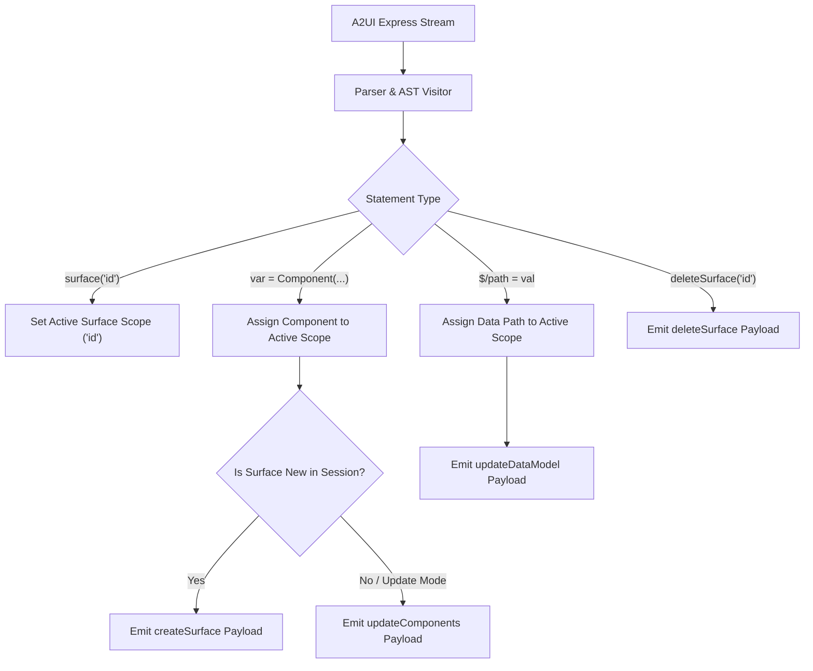

# Express DSL `surface()` Design Proposal

## Executive Summary

A2UI Express DSL is a compact declarative syntax designed for generative user interface models. Standard A2UI wire protocol distinguishes between initializing a surface (`createSurface`) and updating components on an existing surface (`updateComponents`).

To prevent unnecessary model complexity and state tracking errors, Express DSL abstracts this protocol distinction behind a single top-level `surface()` directive. The model uses `surface("surface_id")` to specify the target surface for subsequent component definitions. The host-side compiler automatically resolves whether to emit a `createSurface` or `updateComponents` wire protocol envelope based on session state and context.

---

## Key Design Principles

1. **Model Simplicity**: The model does not need to track surface lifecycle state across turns. A single `surface("id")` call sets the target surface for component assignments.
2. **Compiler State Handling**: The compiler handles wire protocol mapping:
   - Initial rendering emits a `createSurface` message payload.
   - Subsequent updates emit an `updateComponents` message payload.
3. **Multi-Surface Support**: A single `<a2ui>` DSL block can target or switch between multiple surfaces using sequential `surface("id")` calls.
4. **Backward Compatibility**: If `surface()` is omitted from a DSL block, the compiler uses the default `surface_id` parameter (default `"default_surface"`).
5. **Protocol Verbs**: `deleteSurface("id")` remains an explicit standalone command for destroying a surface.

---

## Grammar & Syntax

`surface` is a top-level statement with positional or keyword parameters:

```ebnf
surfaceStatement = "surface(" surfaceId [ "," catalogId ] ")" ;
```

### Signatures

- `surface(surfaceId)`
- `surface(surfaceId, catalogId)`
- `surface(surfaceId="id", catalogId="uri")`

### Parameters

| Parameter   | Type   | Required | Description                                      |
| :---------- | :----- | :------- | :----------------------------------------------- |
| `surfaceId` | String | Yes      | Unique string identifier for the target surface. |
| `catalogId` | String | No       | Component catalog schema URI or identifier.      |

---

## Usage Examples

### Single Surface Declaration

```express
<a2ui>
surface("dashboard-surface-1")
root = Card(main_column)
main_column = Column([title, metric_card])
title = Text("Sales Dashboard", "h2")
metric_card = Card(Text("$12,450"))
</a2ui>
```

#### Compiled Output (Initial Render -> A2UI v1.0 `createSurface` Payload)

```json
[
  {
    "version": "v1.0",
    "createSurface": {
      "surfaceId": "dashboard-surface-1",
      "catalogId": "https://a2ui.org/specification/v1_0/catalogs/basic/catalog.json",
      "components": [
        {
          "id": "root",
          "component": "Card",
          "child": "main_column"
        },
        {
          "id": "main_column",
          "component": "Column",
          "children": ["title", "metric_card"]
        },
        {
          "id": "title",
          "component": "Text",
          "text": "Sales Dashboard",
          "variant": "h2"
        },
        {
          "id": "metric_card",
          "component": "Card",
          "child": "Text_inline_1"
        },
        {
          "id": "Text_inline_1",
          "component": "Text",
          "text": "$12,450"
        }
      ]
    }
  }
]
```

### Subsequent Turn / Component Update

If a subsequent turn outputs DSL targeting the same surface ID:

```express
<a2ui>
surface("dashboard-surface-1")
root = Card(main_column)
main_column = Column([title, metric_card, status_text])
title = Text("Sales Dashboard", "h2")
metric_card = Card(Text("$15,800"))
status_text = Text("Updated 1m ago", "caption")
</a2ui>
```

#### Compiled Output (Active Surface -> A2UI v1.0 `updateComponents` Payload)

```json
[
  {
    "version": "v1.0",
    "updateComponents": {
      "surfaceId": "dashboard-surface-1",
      "components": [
        {
          "id": "root",
          "component": "Card",
          "child": "main_column"
        },
        {
          "id": "main_column",
          "component": "Column",
          "children": ["title", "metric_card", "status_text"]
        },
        {
          "id": "title",
          "component": "Text",
          "text": "Sales Dashboard",
          "variant": "h2"
        },
        {
          "id": "metric_card",
          "component": "Card",
          "child": "Text_inline_1"
        },
        {
          "id": "Text_inline_1",
          "component": "Text",
          "text": "$15,800"
        },
        {
          "id": "status_text",
          "component": "Text",
          "text": "Updated 1m ago",
          "variant": "caption"
        }
      ]
    }
  }
]
```

### Multi-Surface Output in a Single DSL Block

```express
<a2ui>
surface("header-surface")
root = Row([app_title])
app_title = Text("Analytics Portal", "h1")

surface("sidebar-surface")
root = Column([nav_home, nav_reports])
nav_home = Button(Text("Home"))
nav_reports = Button(Text("Reports"))
</a2ui>
```

---

## Compiler Architecture & Execution Pipeline



### Surface Scope Partitioning

1. **Scope Initialization**: A `surface("id")` statement opens a surface scope for `"id"`.
2. **Scope Termination**: A scope ends when another `surface("id")` call, a `deleteSurface("id")` call, or the end of the DSL block is reached.
3. **Protocol Mapping**:
   - If the compiler is configured in single-pass / fresh surface mode (or if `"id"` has not been created yet in the active session), it emits a `createSurface` envelope.
   - If the surface already exists in the active session, it emits an `updateComponents` envelope.
4. **Backward Compatibility**: If no `surface()` call is present before variable assignments begin, the compiler creates an implicit scope using the default `surface_id` compiler parameter (`"default_surface"`).

---

## Implementation Checklist

1. **Compiler Updates** (`compiler.py`):
   - Update ANTLR visitor to handle `surface(surfaceId, catalogId?)` calls.
   - Implement `SurfaceScope` context management.
   - Integrate session / compiler flag to toggle between `createSurface` and `updateComponents` protocol envelopes.
2. **Decompiler Updates** (`decompiler.py`):
   - Update `decompile()` to output `surface("surfaceId")` statements when decompiling `createSurface` or `updateComponents` envelopes.
3. **Prompt Generator & Documentation** (`prompt_generator.py`, `a2ui_express.md`):
   - Add system prompt rule documenting `surface("surface_id")`.
   - Update `a2ui_express.md` specification text.
4. **Test Suite** (`test_compiler.py`, `test_parser_decompile.py`, `test_integration.py`):
   - Add unit and integration tests for `surface()` compilation and decompilation.
