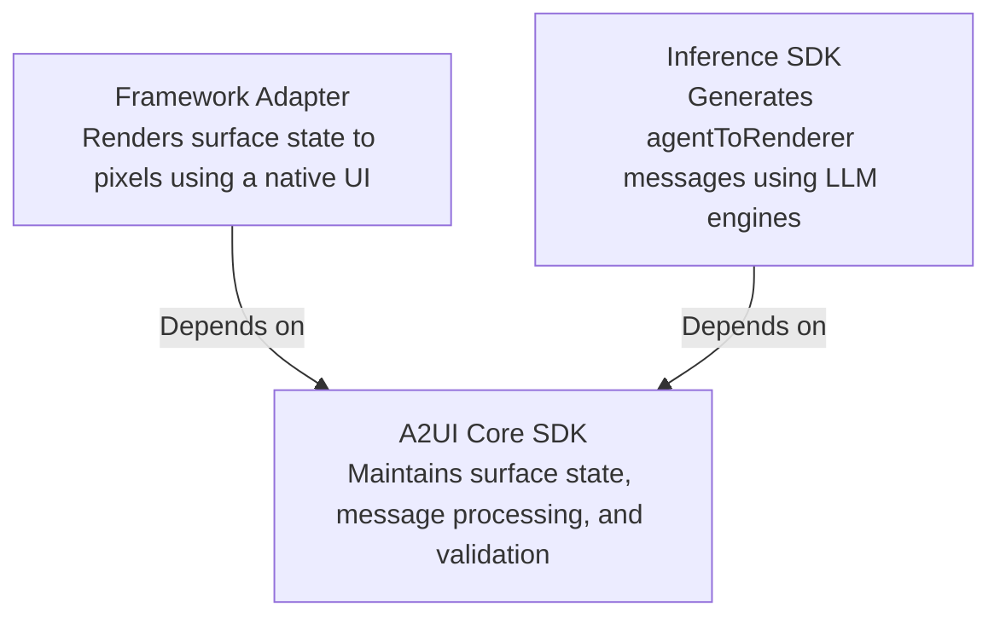

# A2UI Unified SDK Architecture

This document describes the unified architecture of the A2UI SDK ecosystem. To support modern, multi-paradigm generative UI applications, A2UI separates concerns into a modular, three-tiered structure: the **A2UI Core SDK**, the **Inference SDK**, and **Framework Adapters**. This structure is replicated across different languages.

This architecture enables high code reuse, strict conformance, and unified behavior across languages. Ensuring that we use a consistent codebase structure and terminology across languages also makes it easier to maintain the codebases together and add new features across languages using spec-driven development.

## 1. Ecosystem Dependency Structure

Framework adapter and inference SDKs depend on the core SDK as shown below:

## 2. Library Responsibilities

### A2UI Core SDK (`a2ui_core` / `@a2ui/core`)

**Availability:** Every target language (TS, Dart, Python, Kotlin, Swift, C++).  
**Responsibility:** Provides the foundational, language-native representations of the official A2UI specifications.

- **Protocol Models:** Strongly-typed classes representing Catalog declarations (`Catalog`, `ComponentApi`, `FunctionApi`) and A2UI message types (`RendererToAgent`, `AgentToRenderer`, etc.).
- **Surface State Management:** Mutable models representing active UI surfaces (`SurfaceModel`, `ComponentModel`, `DataModel`).
- **Processing Layer (`MessageProcessor`):** Evaluates incoming JSON message arrays, resolves relative JSON pointers, and updates surface state models.
- **Validation:** Performs strict validation of message schema structures and reference checks.
- **Incremental Snapshotting:** Supports tracking and collapsing incremental updates into flat snapshots (e.g., `ComponentNode` trees).

### Inference SDK (`a2ui_inference` / `@a2ui/inference`)

**Availability:** All supported agent languages and select renderer-side languages (for local inference).  
**Responsibility:** Guides Large Language Models (LLMs) to generate valid A2UI message payloads based on a defined component Catalog and active application context.

- **Inference Strategies:** Standard structured generation schemes.
- **Prompt Construction:** Building prompt buffers and feeding component capability schemas dynamically to LLM contexts.
- **Message Parsing:** Safely extracting and repairing raw JSON envelopes from LLM completion streams.
- **Error Repair & Retries:** Programmatic fixing of malformed or invalid schemas.

### Framework Adapters (`react_renderer`, `compose_renderer`, etc.)

**Availability:** Every supported UI framework across renderer platforms.  
**Responsibility:** Paints the state of a Core `SurfaceModel` onto physical screen pixels using native UI hierarchies.

- **Framework Entry View (`Surface`):** Observes Core state and boots the recursive layout loop.
- **Component Renderers (`ComponentImplementation`):** Individual native views implementing visual specs (e.g., standard layout, text, or inputs from the Basic Catalog).
- **Lifecycle Bindings:** Standardizes lazy-mounting, reactive value propagation, and memory leak prevention (`dispose`).
